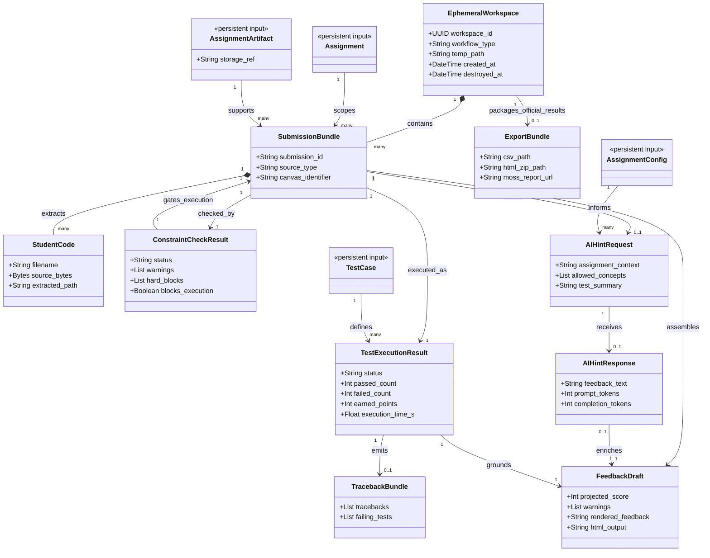

Ephemeral grading pipeline model only. This diagram represents RAM-only or temp-workspace objects created during an active official batch or sandbox grading request and destroyed after completion or session exit.

