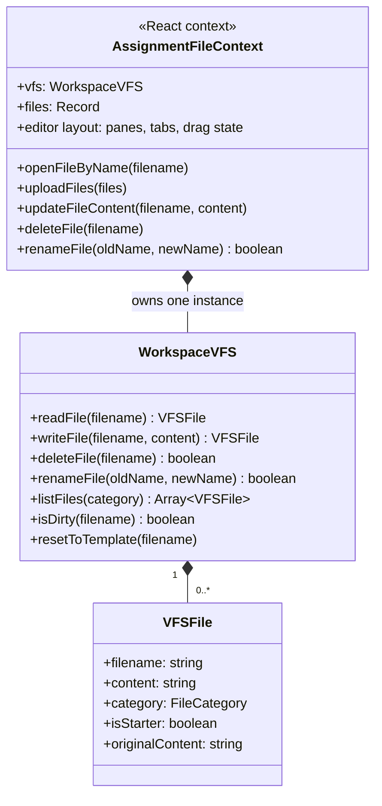

```mermaid
classDiagram
    class AssignmentFileContext {
        <<React context>>
        +vfs: WorkspaceVFS
        +files: Record
        +editor layout: panes, tabs, drag state
        +openFileByName(filename)
        +uploadFiles(files)
        +updateFileContent(filename, content)
        +deleteFile(filename)
        +renameFile(oldName, newName) boolean
    }
    class WorkspaceVFS {
        +readFile(filename) VFSFile
        +writeFile(filename, content) VFSFile
        +deleteFile(filename) boolean
        +renameFile(oldName, newName) boolean
        +listFiles(category) Array~VFSFile~
        +isDirty(filename) boolean
        +resetToTemplate(filename)
    }
    class VFSFile {
        +filename: string
        +content: string
        +category: FileCategory
        +isStarter: boolean
        +originalContent: string
    }
    AssignmentFileContext *-- WorkspaceVFS : owns one instance
    WorkspaceVFS "1" *-- "0..*" VFSFile
```