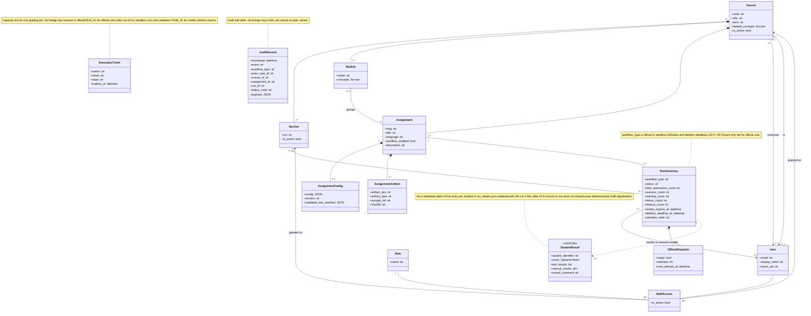

```mermaid
classDiagram
    class Course {
        +code: str
        +title: str
        +term: str
        +default_concepts: list~str~
        +is_active: bool
    }
    class Section {
        +crn: str
        +is_active: bool
    }
    class Module {
        +name: str
        +concepts: list~str~
    }
    class Assignment {
        +slug: str
        +title: str
        +language: str
        +sandbox_enabled: bool
        +description: str
    }
    class AssignmentConfig {
        +config: JSON
        +version: int
        +validated_test_manifest: JSON
    }
    class AssignmentArtifact {
        +artifact_key: str
        +artifact_type: str
        +storage_ref: str
        +sha256: str
    }
    class User {
        +email: str
        +display_name: str
        +azure_oid: str
    }
    class Role {
        +name: str
    }
    class StaffAccess {
        +is_active: bool
    }
    class RunSummary {
        +workflow_type: str
        +status: str
        +total_submission_count: int
        +success_count: int
        +warning_count: int
        +failure_count: int
        +timeout_count: int
        +review_expires_at: datetime
        +deletion_deadline_at: datetime
        +retention_state: str
    }
    class OfficialDispatch {
        +ready: bool
        +attempts: int
        +next_attempt_at: datetime
    }
    class ExecutionTicket {
        +owner: str
        +token: str
        +state: str
        +expires_at: datetime
    }
    class AuditRecord {
        +timestamp: datetime
        +event: str
        +workflow_type: str
        +actor_user_id: int
        +course_id: str
        +assignment_id: str
        +run_id: int
        +status_code: int
        +payload: JSON
    }
    class StudentResult {
        <<JSON file>>
        +student_identifier: str
        +score: Optional~float~
        +test_results: list
        +manual_results: dict
        +overall_comment: str
    }

    Course "1" *-- "0..*" Section
    Course "1" *-- "0..*" Module
    Course "1" *-- "0..*" Assignment
    Course "0..*" --> "0..1" User : instructor
    Course "0..*" --> "0..1" User : ia
    Module "0..1" o-- "0..*" Assignment : groups
    Assignment "1" *-- "0..1" AssignmentConfig
    Assignment "1" *-- "0..*" AssignmentArtifact
    User "1" -- "0..*" StaffAccess
    Role "1" -- "0..*" StaffAccess
    StaffAccess "0..*" --> "0..1" Course : granted on
    StaffAccess "0..*" --> "0..1" Section : granted on
    Assignment "1" -- "0..*" RunSummary
    Section "0..1" -- "0..*" RunSummary
    RunSummary "0..*" --> "0..1" User : actor
    RunSummary "1" *-- "0..1" OfficialDispatch
    RunSummary "1" ..> "0..*" StudentResult : results on shared volume

    note for RunSummary "workflow_type is official or sandbox.\nReview and deletion deadlines (23 h / 24 h)\nare only set for official runs."
    note for ExecutionTicket "Capacity slot for one grading job. No foreign key.\nowner is official:RUN_ID for official runs,\nthe run ID for sandbox runs,\nor validation:TASK_ID for model-solution checks."
    note for AuditRecord "Audit trail table. No foreign keys:\nIDs are stored as plain values."
    note for StudentResult "Not a database table.\nOne entry per student in run_details.json,\ndeleted with the run's files after 24 h.\nscore is null when an infrastructure failure\nneeds staff adjudication."
```
