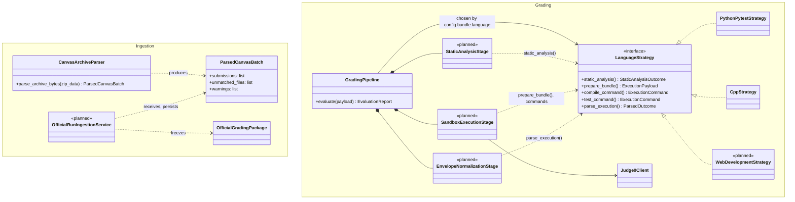

```mermaid
classDiagram
    namespace Ingestion {
        class CanvasArchiveParser {
            +parse_archive_bytes(zip_data) ParsedCanvasBatch
        }
        class ParsedCanvasBatch {
            +submissions: list
            +unmatched_files: list
            +warnings: list
        }
        class OfficialRunIngestionService {
            <<planned>>
        }
        class OfficialGradingPackage
    }
    namespace Grading {
        class GradingPipeline {
            +evaluate(payload) EvaluationReport
        }
        class StaticAnalysisStage {
            <<planned>>
        }
        class SandboxExecutionStage {
            <<planned>>
        }
        class EnvelopeNormalizationStage {
            <<planned>>
        }
        class LanguageStrategy {
            <<interface>>
            +static_analysis() StaticAnalysisOutcome
            +prepare_bundle() ExecutionPayload
            +compile_command() ExecutionCommand
            +test_command() ExecutionCommand
            +parse_execution() ParsedOutcome
        }
        class PythonPytestStrategy
        class CppStrategy
        class WebDevelopmentStrategy {
            <<planned>>
        }
        class Judge0Client
    }

    CanvasArchiveParser ..> ParsedCanvasBatch : produces
    OfficialRunIngestionService ..> ParsedCanvasBatch : receives, persists
    OfficialRunIngestionService ..> OfficialGradingPackage : freezes
    GradingPipeline *-- StaticAnalysisStage
    GradingPipeline *-- SandboxExecutionStage
    GradingPipeline *-- EnvelopeNormalizationStage
    GradingPipeline --> LanguageStrategy : chosen by config.bundle.language
    StaticAnalysisStage ..> LanguageStrategy : static_analysis()
    SandboxExecutionStage ..> LanguageStrategy : prepare_bundle(), commands
    EnvelopeNormalizationStage ..> LanguageStrategy : parse_execution()
    SandboxExecutionStage --> Judge0Client
    LanguageStrategy <|.. PythonPytestStrategy
    LanguageStrategy <|.. CppStrategy
    LanguageStrategy <|.. WebDevelopmentStrategy
```