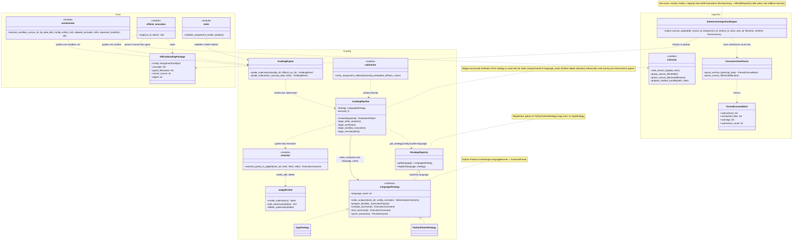

```mermaid
classDiagram
    namespace Runs {
        class orchestrator {
            <<module>>
            +execute_sandbox_run(run_id, zip_data_b64, config, artifact_refs, allowed_concepts, stdin, expected_manifest) dict
        }
        class official_execution {
            <<module>>
            +step(run_id, token) dict
        }
        class tasks {
            <<module>>
            +validate_assignment_model_solution()
        }
        class OfficialGradingPackage {
            +config: AssignmentConfigV1
            +concepts: list
            +pytest_filenames: list
            +runner_source: str
            +digest: str
        }
    }
    namespace Ingestion {
        class SubmissionIngestionEngine {
            +ingest_canvas_upload(db, course_id, assignment_id, section_id, actor_user_id, filename, content) RunSummary
        }
        class CanvasArchiveParser {
            +parse_archive_bytes(zip_data) ParsedCanvasBatch
            +parse_canvas_filename(filename)
        }
        class ParsedCanvasBatch {
            +submissions: list
            +unmatched_files: list
            +warnings: list
            +submission_count: int
        }
        class extractor {
            <<module>>
            +safe_extract_zip(data, dest)
            +group_canvas_files(folder)
            +parse_canvas_filename(filename)
            +prepare_student_bundle(paths, dest)
        }
    }
    namespace Grading {
        class GradingEngine {
            +grade_submission(bundle_dir, official_run_id) GradingResult
            +grade_submission_sync(zip_data, stdin) GradingResult
        }
        class GradingPipeline {
            -strategy: LanguageStrategy
            -executor_fn
            +evaluate(payload) EvaluationReport
            -stage_static_analysis()
            -stage_synthesis()
            -stage_sandbox_execution()
            -stage_normalization()
        }
        class calibration {
            <<module>>
            +verify_assignment_calibration(config, preloaded_artifacts, cases)
        }
        class StrategyRegistry {
            +get(language) LanguageStrategy
            +register(language, strategy)
        }
        class LanguageStrategy {
            <<interface>>
            +language_name: str
            +static_analysis(exec_dir, config, concepts) StaticAnalysisOutcome
            +prepare_bundle() ExecutionPayload
            +compile_command() ExecutionCommand
            +test_command() ExecutionCommand
            +parse_execution() ParsedOutcome
        }
        class PythonPytestStrategy
        class CppStrategy
        class executor {
            <<module>>
            +execute_pytest_in_judge0(exec_dir, tests, limits, stdin) ExecutionOutcome
        }
        class Judge0Client {
            +create_submission() token
            +poll_submission(token) dict
            +delete_submission(token)
        }
    }

    SubmissionIngestionEngine ..> CanvasArchiveParser : uses submission count only
    CanvasArchiveParser ..> ParsedCanvasBatch : returns
    SubmissionIngestionEngine ..> OfficialGradingPackage : freezes at upload
    official_execution ..> OfficialGradingPackage : loads
    official_execution ..> extractor : parses Canvas files again
    official_execution ..> GradingEngine : grades one student
    orchestrator ..> GradingEngine : grades one sandbox run
    tasks ..> GradingEngine : validates model solution
    GradingEngine ..> GradingPipeline : creates per submission
    calibration ..> GradingPipeline : creates directly
    GradingPipeline ..> StrategyRegistry : get_strategy(config.bundle.language)
    StrategyRegistry "1" o-- "1..*" LanguageStrategy : keyed by language
    GradingPipeline --> LanguageStrategy : static_analysis() and language_name
    LanguageStrategy <|.. PythonPytestStrategy
    LanguageStrategy <|.. CppStrategy
    GradingPipeline ..> executor : pytest-only execution
    executor ..> Judge0Client : create, poll, delete

    note for SubmissionIngestionEngine "Also owns: section checks, capacity lock,\nDB transaction (RunSummary + OfficialDispatch),\nfile writes and rollback recovery"
    note for GradingPipeline "Stages are private methods.\nThe strategy is used only for static analysis\nand its language_name (Python helper injection).\nExecution and scoring are hard-wired to pytest."
    note for LanguageStrategy "Python Protocol combining\nLanguageRunner + OutcomeParser"
    note for StrategyRegistry "Registered: python to PythonPytestStrategy,\ncpp and c to CppStrategy"
```
