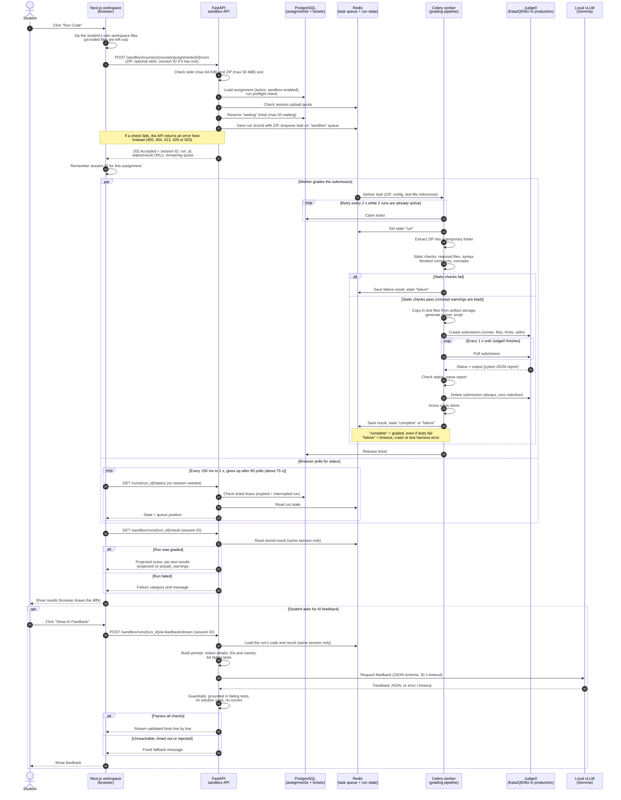
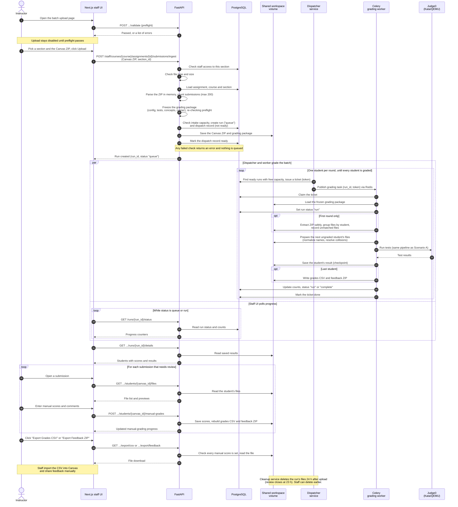

# Student Sandbox Execution & Instant Feedback

```mermaid
sequenceDiagram
    autonumber
    actor S as Student
    participant WS as Next.js workspace<br/>(browser)
    participant API as FastAPI<br/>sandbox API
    participant DB as PostgreSQL<br/>(assignments + tickets)
    participant R as Redis<br/>(task queue + run state)
    participant W as Celery worker<br/>(grading pipeline)
    participant J as Judge0<br/>(Kata/QEMU in production)
    participant AI as Local vLLM<br/>(Gemma)

    %% ---------- 1. Submit ----------
    S->>WS: Click "Run Code"
    WS->>WS: Zip the student's own workspace files<br/>(provided files are left out)
    WS->>API: POST /sandbox/courses/{course}/assignments/{id}/runs<br/>(ZIP, optional stdin, session ID if it has one)
    API->>API: Check stdin (max 64 KiB) and ZIP (max 50 MiB) size
    API->>DB: Load assignment (active, sandbox-enabled),<br/>run preflight check
    API->>R: Check session upload quota
    API->>DB: Reserve "waiting" ticket (max 50 waiting)
    API->>R: Save run record with ZIP, enqueue task on "sandbox" queue
    Note over WS,API: If a check fails, the API returns an error here<br/>instead (400, 404, 413, 429 or 503)
    API-->>WS: 202 Accepted + session ID, run_id,<br/>status/result URLs, remaining quota
    WS->>WS: Remember session ID for this assignment

    %% ---------- 2. Grade in the background while the browser polls ----------
    par Worker grades the submission
        R->>W: Deliver task (ZIP, config, test-file references)
        loop Retry every 2 s while 2 runs are already active
            W->>DB: Claim ticket
        end
        W->>R: Set state "run"
        W->>W: Extract ZIP into a temporary folder
        W->>W: Static checks: required files, syntax,<br/>blocked constructs, concepts
        alt Static checks fail
            W->>R: Save failure result, state "failure"
        else Static checks pass (concept warnings are kept)
            W->>W: Copy in test files from artifact storage,<br/>generate runner script
            W->>J: Create submission (runner, files, limits, stdin)
            loop Every 1 s until Judge0 finishes
                W->>J: Poll submission
            end
            J-->>W: Status + output (pytest JSON report)
            W->>W: Check status, parse report
            W->>J: Delete submission (always, zero retention)
            W->>W: Score rubric items
            W->>R: Save result, state "complete" or "failure"
            Note over R,W: "complete" = graded, even if tests fail<br/>"failure" = timeout, crash or test harness error
        end
        W->>DB: Release ticket
    and Browser polls for status
        loop Every 150 ms to 1 s, gives up after 80 polls (about 75 s)
            WS->>API: GET /runs/{run_id}/status (no session needed)
            API->>DB: Check ticket lease (expired = interrupted run)
            API->>R: Read run state
            API-->>WS: State + queue position
        end
    end

    %% ---------- 3. Show results ----------
    WS->>API: GET /sandbox/runs/{run_id}/result (session ID)
    API->>R: Read stored result (same session only)
    alt Run was graded
        API-->>WS: Projected score, per-test results<br/>(expected vs actual), warnings
    else Run failed
        API-->>WS: Failure category and message
    end
    WS-->>S: Show results (browser draws the diffs)

    %% ---------- 4. Optional AI feedback ----------
    opt Student asks for AI feedback
        S->>WS: Click "Show AI Feedback"
        WS->>API: POST /sandbox/runs/{run_id}/ai-feedback/stream (session ID)
        API->>R: Load the run's code and result (same session only)
        API->>API: Build prompt: redact emails, IDs and names,<br/>list failing tests
        API->>AI: Request feedback (JSON schema, 30 s timeout)
        AI-->>API: Feedback JSON, or error / timeout
        API->>API: Guardrails: grounded in failing tests,<br/>no solution code, no scores
        alt Passes all checks
            API-->>WS: Stream validated hints line by line
        else Unreachable, timed out or rejected
            API-->>WS: Fixed fallback message
        end
        WS-->>S: Show feedback
    end
```

# Official Batch Intake & Execution Lifecycle

```mermaid
sequenceDiagram
    autonumber
    actor Staff as Instructor
    participant UI as Next.js staff UI
    participant API as FastAPI
    participant DB as PostgreSQL
    participant Vol as Shared workspace<br/>volume
    participant D as Dispatcher<br/>service
    participant W as Celery<br/>grading worker
    participant J as Judge0<br/>(Kata/QEMU)

    %% ---------- 1. Upload and intake ----------
    Staff->>UI: Open the batch upload page
    UI->>API: POST .../validate (preflight)
    API-->>UI: Passed, or a list of errors
    Note over Staff,UI: Upload stays disabled until preflight passes
    Staff->>UI: Pick a section and the Canvas ZIP, click Upload
    UI->>API: POST /staff/courses/{course}/assignments/{id}/submissions/ingest<br/>(Canvas ZIP, section_id)
    API->>DB: Check staff access to this section
    API->>API: Check file type and size
    API->>DB: Load assignment, course and section
    API->>API: Parse the ZIP in memory, count submissions (max 200)
    API->>API: Freeze the grading package<br/>(config, tests, concepts, runner), re-checking preflight
    API->>DB: Check intake capacity, create run ("queue")<br/>and dispatch record (not ready)
    API->>Vol: Save the Canvas ZIP and grading package
    API->>DB: Mark the dispatch record ready
    Note over API,DB: Any failed check returns an error and nothing is queued
    API-->>UI: Run created (run_id, status "queue")

    %% ---------- 2. Grade one student per round, while the UI polls ----------
    par Dispatcher and worker grade the batch
        loop One student per round, until every student is graded
            D->>DB: Find ready runs with free capacity, issue a ticket (token)
            D->>W: Publish grading task (run_id, token) via Redis
            W->>DB: Claim the ticket
            W->>Vol: Load the frozen grading package
            W->>DB: Set run status "run"
            opt First round only
                W->>Vol: Extract ZIP safely, group files by student,<br/>record unmatched files
            end
            W->>Vol: Prepare the next ungraded student's files<br/>(normalize names, resolve collisions)
            W->>J: Run tests (same pipeline as Scenario A)
            J-->>W: Test results
            W->>Vol: Save the student's result (checkpoint)
            opt Last student
                W->>Vol: Write grades CSV and feedback ZIP
            end
            W->>DB: Update counts, status "run" or "complete"
            W->>DB: Mark the ticket done
        end
    and Staff UI polls progress
        loop While status is queue or run
            UI->>API: GET /runs/{run_id}/status
            API->>DB: Read run status and counts
            API-->>UI: Progress counters
            
        end
    end

    %% ---------- 3. Review and manual grading ----------
    UI->>API: GET .../runs/{run_id}/details
    API->>Vol: Read saved results
    API-->>UI: Students with scores and results
    loop For each submission that needs review
        Staff->>UI: Open a submission
        UI->>API: GET .../students/{canvas_id}/files
        API->>Vol: Read the student's files
        API-->>UI: File list and previews
        Staff->>UI: Enter manual scores and comments
        UI->>API: POST .../students/{canvas_id}/manual-grades
        API->>Vol: Save scores, rebuild grades CSV and feedback ZIP
        API-->>UI: Updated manual-grading progress
    end

    %% ---------- 4. Export ----------
    Staff->>UI: Click "Export Grades CSV" or "Export Feedback ZIP"
    UI->>API: GET .../export/csv or .../export/feedback
    API->>Vol: Check every manual score is set, read the file
    API-->>UI: File download
    Note over Staff,UI: Staff import the CSV into Canvas<br/>and share feedback manually
    Note over Vol,D: Cleanup service deletes the run's files 24 h after upload<br/>(review closes at 23 h). Staff can delete earlier.
```