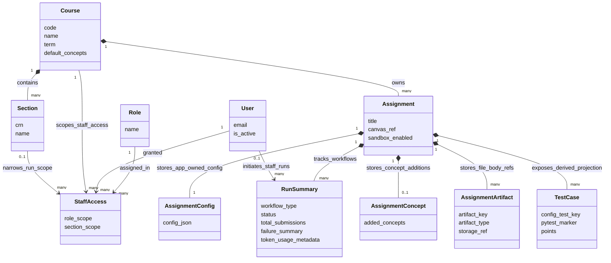

Persistent M1 data model only. This diagram represents the product concepts stored in PostgreSQL and excludes student submissions, tracebacks, AI hint bodies, and other zero-retention pipeline artifacts.

