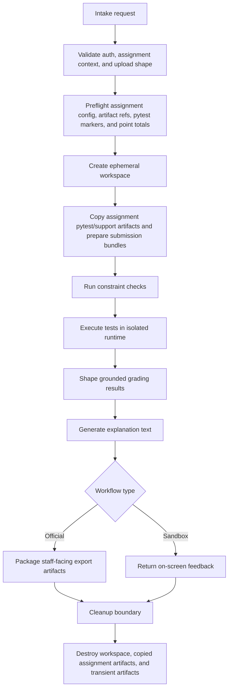

Ephemeral grading pipeline model only. This diagram represents the workflow stages that exist only during an active official batch or sandbox grading request and are destroyed after completion or session exit.

## Diagram Notes

- Persistent inputs such as assignment config, assignment artifacts, derived test metadata, and staff access checks inform the workflow but are not recreated as persistent outputs.
- Assignment pytest and support artifacts are copied into the ephemeral execution workspace for a run; those copied file bodies are destroyed with the student workspace after execution.
- Cleanup is mandatory for both official and sandbox workflows.
- The diagram is intentionally technology-neutral; concrete execution, AI, queue, and storage choices live in the prose specs.
- Official-run review is preview-only in M1; this diagram focuses on the ephemeral grading and cleanup lifecycle.
