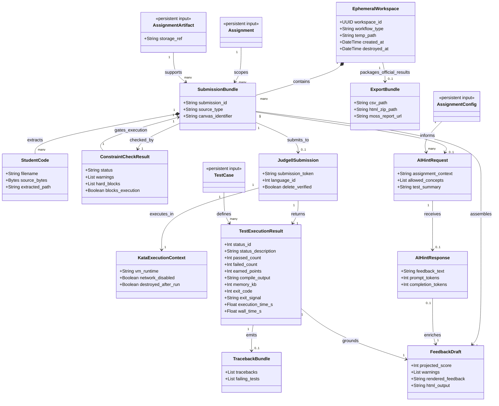

Ephemeral grading pipeline model only. This diagram represents RAM-only or temp-workspace objects created during an active official batch or sandbox grading request and destroyed after completion or session exit. It also includes transient Judge0 submission/result artifacts and Kata-backed execution artifacts, which must be deleted or invalidated immediately after retrieval.

