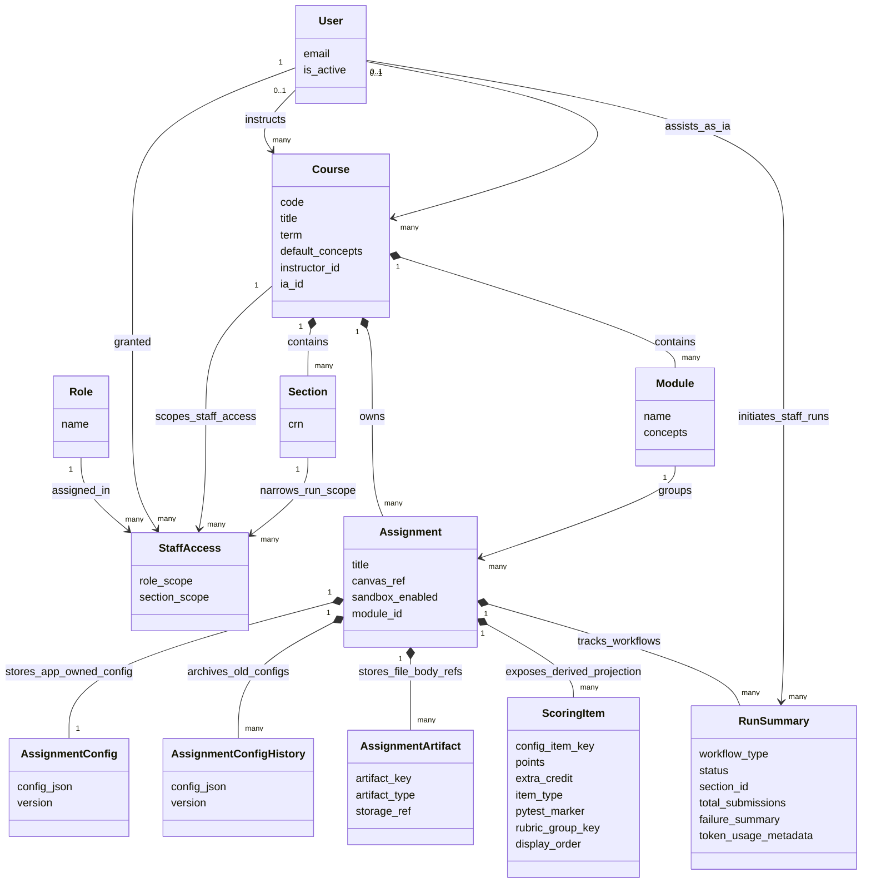
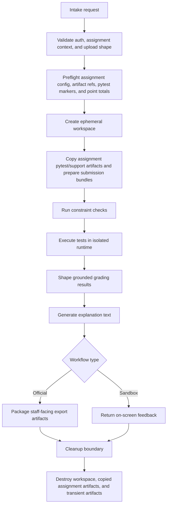

# UVU Autograder — Technical Specifications

> [!NOTE]
> **Schema References**:
> - Assignment configuration schema is defined in [config_v1.schema.json](../schemas/config_v1.schema.json).
> - API specification is defined in [openapi.json](../schemas/openapi.json).
> - Those JSON snapshots may lag Pydantic models after schema cleanups; regenerate before treating them as authoritative.

## 1. System Architecture

- Frontend: Next.js in the current local/on-prem stack on the Dell workstation for staff and student interfaces.
- UI language: TypeScript for frontend type safety.
- Code editor and review surface: Monaco Editor, locally hosted with the frontend app for read-only preview and review workflows.
- Backend: FastAPI in the current local/on-prem stack for routing, orchestration, and API contracts.
- Backend language: Python `3.11+`.
- Execution engine: Judge0 CE for sandboxed code execution with strict resource limits and network-disabled student runs.
- Runtime isolation: Kata Containers is the required VM-based isolation layer for the intended deployment. The backlog records a successful Dell workstation spot-check; release-specific evidence is still required by the delivery controls.
- Database: PostgreSQL in the current local/on-prem stack for non-sensitive metadata only.
- ORM and migrations: SQLAlchemy plus Alembic.
- Queue and broker: Celery with Redis for official and sandbox grading jobs.
- AI inference: Sandbox Local LLM request/streaming endpoints and UI are implemented for explanations grounded in pytest and AST results. This does not establish approval for live student-derived inputs; official-run AI remains deferred.
- HTTP client: `httpx` for FastAPI-to-Judge0 async REST calls.

## 2. Core Features

- Staff authentication: current mock JWT login accepts `@uvu.edu` addresses without verifying ownership. Institutional Microsoft authentication with explicit staff grants is active pilot-readiness work, not yet implemented.
- Student sandbox access through globally visible sandbox-enabled assignments without student-specific authentication.
- Progressive `Concepts Covered` enforcement using AST validation (LLM prompt context when sandbox Local LLM is enabled).
- Retention-aware grading: sandbox wipe after results; official identifiable review/export artifacts ≤24h or until staff cleanup; Judge0/Kata artifacts deleted immediately after retrieval.
- Multi-file support uses ZIP/project bundle uploads for both official staff runs and student sandbox runs.
- Hallucination guardrails (when Local LLM is enabled): treat pytest and tracebacks as ground truth; LLM explains, does not re-grade (sandbox only).
- Prefer fake/synthetic or completely anonymized validation data until live-data posture is confirmed for a workflow.

### Implementation status and known gaps (2026-09-21)

The contracts below describe required behavior, not a claim that all launch gates have passed. Core setup, sandbox grading, official review/manual grading, and exports are implemented. Existing tests and workstation reports do not replace release-specific integrated verification.

- **Retention:** Official review access ends 23 hours after intake. The independent cleanup worker reconciles every 60 seconds, tombstones expired runs before deletion, verifies removal of the official ZIP and workspace, and reports retryable failures. A remaining file at 24 hours is a visible retention breach; host rollout and recovery evidence remain open.
- **Batch capacity:** Official ingest reserves one waiting slot per submission against a global cap of 50, so a single upload above 50 submissions is rejected. The whole official batch also inherits Celery's 120s soft / 180s hard task limits. Bounded scheduling and an appropriate task lifecycle are required to meet the 200-submission target.
- **Deployment:** The single-origin Nginx reverse proxy deployment is active on port 80 of the Dell workstation. The proxy reserves `/api/*` for backend requests, removing `/api` before forwarding to FastAPI routes on `127.0.0.1:8000`; Next.js on `127.0.0.1:3000` handles page routes including `/staff/*` and `/sandbox/*`. Frontend API client calls route through the single origin (`/api`) without port switching or cross-origin credentials.
- **Evidence:** The backlog's 35-submission timing is a measurement; the 200-submission estimate is a projection. Use the evidence labels and launch gates in [delivery_controls.md](../planning/delivery_controls.md).

## 3. Architecture Patterns Reused

- **Async Job Queueing:** Submitty/Tango pattern for Celery-backed worker queueing and status polling.
- **Output Normalization:** Standardized string normalizer (`app/domains/grading/normalizer.py`) stripping trailing whitespace and normalizing line endings (`\r\n` -> `\n`) to prevent false test failures.

## 4. Pipeline Execution Summaries

- **Official Staff Batch Grading:** Canvas ZIP archive -> Ingest Validation -> Ephemeral Workspace Extraction -> Assignment Config & AST Validation -> Judge0 Execution (in Kata VM) -> Result Formatting -> Staff CSV/Feedback Export Package -> Ephemeral Review Retention (≤24h or staff cleanup).
- **Student Sandbox Runs:** ZIP Bundle -> Rate Limiting -> Ephemeral Extraction -> AST Validation -> Judge0 Execution -> On-screen Results & Visual Diff -> Immediate Cleanup.
- **Assignment Configuration Setup:** Instructor Wizard -> App-Owned `config_json` v1 -> Pytest/Model Solution Artifact Upload -> Model Solution Verification in Judge0 -> Published Assignment Config.

## 5. Data Model

### Persistent PostgreSQL entities

- `users`
- `roles`
- `courses`
- `modules`
- `sections`
- `staff_access`
- `assignments`
- `assignment_configs`
- `assignment_artifacts`
- `scoring_items`
- `run_summaries`

### Persistent model notes

- `staff_access` stores user, role, course, optional section, and permission semantics.
- `courses` store the teacher-authored default `Concepts Covered` baseline used across assignments in that course.
- `assignments` are course-linked, while section-level edit authority is enforced through staff access rules.
- `assignment_configs` store the app-owned `config_json`, which is the canonical internal grading configuration; the frontend wizard is the authoring surface for that config.
- `assignment_configs` also store ZIP/project bundle requirements such as required files, entrypoint, and layout expectations.
- `modules` store module-specific learning concepts; runtime-effective whitelist is course defaults ∪ cumulative module concepts. Per-assignment concept additions were removed, but assignment configs may specify a `concepts.denylist` to forbid specific inherited constructs (e.g. built-in sorting).
- `assignment_artifacts` store lightweight metadata and storage references for assignment-owned files such as pytest files, model solutions, and support files.
- `scoring_items` are derived records used for querying, validation, and UI rendering; they must never become a second editable grading source of truth.
- `scoring_items` are derived projections of both automated test keys and manual rubric items, used for grading display and configuration checking.
- `run_summaries` store workflow type, actor, aggregate counts, failure categories, and sanitized local LLM token usage only.
- Judge0 submission tokens and raw Judge0 result payloads are transient execution-service data and must not be persisted as app-owned Postgres records.
- Persistent operational metadata must remain aggregate-only and non-identifying; filenames, student identifiers, raw tracebacks, detailed failure text, and code snippets must not be stored in long-lived metadata tables or logs.

### Concepts Covered contract

- The course-level baseline is teacher-authored and stored with the course settings.
- Module concepts represent additional learning concepts defined on the module.
- The effective concept allow-list is computed at runtime as `(course defaults ∪ cumulative module concepts 1..N) \ config_json.concepts.denylist`.
- Runtime merge rules:
  - course defaults appear first
  - module concepts appear after course defaults
  - duplicate concepts are removed automatically
  - assignment-level `concepts.denylist` removes matching concepts from the effective allowed list
- AST enforcement and any UI display of allowed concepts must use the same merged effective list.
- Existing assignments always reflect the current course defaults and module concepts at runtime.
- Reusing the same assignment config shape in a different course/module may produce a different effective concept list because course defaults and module concepts are owned by the course and module.

- **AST Node Mapping**: To support automated concept whitelisting, the backend AST parser maps human-readable concepts to Python AST nodes as follows:

| Concept | Python AST Nodes / Constructs Checked | Description |
| :--- | :--- | :--- |
| `loops` | `ast.For`, `ast.While`, `ast.AsyncFor` | Enforces or verifies structure contains loops. |
| `conditionals` | `ast.If`, `ast.Compare`, `ast.IfExp` | Verifies presence of logical branching/conditional checks. |
| `functions` | `ast.FunctionDef`, `ast.AsyncFunctionDef`, `ast.Call` | Enforces function definitions and function calls. |
| `variables` | `ast.Assign`, `ast.AnnAssign`, `ast.Name` | Tracks variable definitions, annotations, and assignments. |
| `file-io` | `ast.withitem`, `open` function call, `ast.Call` on IO | Detects file open or write constructs. |
| `image-processing` | `PIL` imports, `Image` function/method calls | Verifies Pillow module/methods are used. |

### Assignment `config_json` v1 contract

- The product uses a strict app-owned `assignment_configs.config_json` v1 contract for wizard generation, bundle validation, test projection, model-solution validation, and execution planning.
- `config_json` v1 is Python-focused and pytest-focused. It models multiple pytest files, file requirements, dependencies, rubric groups, and manual rubric items.
- The v1 schema should be expressed as JSON Schema 2020-12 for portable validation. Backend and frontend validators may use implementation-native tools, but they must enforce the same schema and error paths.
- Config entries that need durable identity use stable human-readable keys, not database IDs. Stable keys are required for tests and artifact references.
- Display labels may change without changing stable keys. Renaming a stable key is treated as replacing that config object and should trigger regeneration or reconciliation of derived records.
- Minimum top-level v1 sections:
  - `assignment`
  - `bundle`
  - `artifacts`
  - `scoring_items`
- Optional top-level v1 sections:
  - `concepts` (`allowlist` and `denylist` to subtract inherited constructs)
  - `completion_requirements`
  - `dependencies`
  - `rubric_groups`
  - `manual_rubric_items`
- `assignment` stores assignment-owned display metadata needed by the config surface, such as title or points context. Canvas remains the course/grade source of truth.
- `bundle` stores ZIP/project bundle requirements, including entrypoint rules, file requirements (paths or glob pattern), max files, and supported layout expectations.
- `artifacts` maps stable artifact keys to required artifact type and optional display filename metadata. File bodies are stored through the assignment artifact storage layer, not embedded in config JSON.
- `tests` stores stable test keys, display names, point values, explicit `extra_credit` booleans, and any safe test metadata needed for UI and execution planning.
- The product supports multiple `pytest_file` artifacts per assignment. Each `tests[].key` must be a stable slug, and the pytest marker is derived as `ag_<key>` rather than stored separately.
- One scoring entry may map to multiple pytest functions when those functions share the same `ag_<key>` marker.
- Default scoring is implicit: a scoring item contributes its `points` only when all pytest functions with its derived marker pass. Non-extra-credit items define the base total; passed extra-credit items add points above that base total.
- `completion_requirements`, when present, stores "complete at least X of these Y objectives" rules over existing `tests[].key` values. Each requirement should minimally include a stable key, display label, referenced test keys, and `minimum_passed`.
- Completion requirements report whether an objective threshold is met; they do not replace scoring-item points.
- All scoring entries are visible in staff and sandbox result surfaces.
- `TestCase` and `ScoringItem` rows, UI previews, and execution plans are derived from the app-owned config. If derived rows disagree with the config, the config wins and derived rows must be regenerated or reconciled.
- Strict preflight validation must catch at least: duplicate stable keys, missing `ag_<key>` markers in the pytest files, missing assignment pytest artifacts, invalid point values, missing or invalid `extra_credit` booleans, invalid `completion_requirements` references or thresholds, missing bundle entrypoint rules, unsupported artifact types, and fields outside the supported v1 contract where strict validation applies. This preflight must pass before model-solution validation and before sandbox/official student grading.

### TestCase and artifact contract

- `AssignmentArtifact` is the storage-backed file reference layer for assignment-owned grading assets.
- Minimum artifact classes:
  - `pytest_file`
  - `model_solution`
  - `support_file`
- Expectations by artifact class:
  - `pytest_file`: one or more per assignment; editable, validated through strict marker preflight and test execution, stored as metadata plus storage-backed file body
  - `model_solution`: one real instructor artifact per required bundle path, editable and executable through Judge0; model validation never synthesizes placeholder files
  - `support_file`: assignment-owned file content available to grading and test execution as needed
- `AssignmentArtifact` metadata should stay lightweight: assignment linkage, stable artifact key, artifact type, storage reference, and optional filename are sufficient unless later implementation work proves otherwise.
- Artifact file bodies use the local on-prem filesystem behind a storage interface.
- Artifact storage keys are generated opaque identifiers and must not be based on instructor-provided filenames or paths.
- Optional instructor-provided filenames are display metadata only. They may be shown in staff UI after sanitization, but they must not become storage paths or long-lived student-run metadata.
- Artifact file bodies must be stored outside any web-served directory and retrieved only through authorized backend code.
- Artifact writes must enforce allowlisted artifact types, size limits, checksum capture, generated paths, and least-privilege filesystem permissions.
- Assignment-owned artifacts may persist as grading assets. Student submissions, execution workspaces, generated feedback bodies, and Judge0/Kata execution artifacts remain ephemeral and are not assignment artifacts.
- Artifact delete behavior must remove the local file body and metadata reference, or mark the metadata unusable if deletion fails and surface an actionable admin/staff error.
- `TestCase` is a derived record, not the editable grading definition and not the raw file body.
- Test authoring flows through the wizard/config and pytest artifacts.
- `AssignmentConfig` / app-owned `config_json` wins if it ever disagrees with a derived `TestCase`; derived records must be regenerated or reconciled rather than edited independently.
- `TestCase` should minimally capture:
  - assignment linkage
  - stable config test identifier such as `config_test_key`
  - reference to the pytest artifact used for execution
  - pytest marker such as `ag_handles_empty_input`
  - point value copied from the canonical config for UI/query convenience
  - optional display order for UI/query needs

### Run summary contract

- `RunSummary` should minimally store:
  - workflow type: `official` or `sandbox`
  - actor user reference for staff-triggered workflows, or non-identifying sandbox session identifier as needed
  - assignment reference
  - `section_id` for official runs (required on new ingest; legacy null rows are admin-only)
  - status
  - total submission count
  - success, warning, failure, and timeout counts
  - sanitized token usage
  - coarse failure category summary only
- Admin-only monitoring may summarize sanitized token usage, sandbox upload-limit state, global queued count, running count, approved execution-slot cap, high-load/full-queue state, official versus sandbox queue counts, worker/capacity status, and AI degradation state from run summaries and operational metrics.
- `RunSummary` must not store:
  - student code
  - filenames or submission-path fragments
  - student identifiers
  - traceback bodies
  - detailed failure text
  - code snippets copied from logs or outputs
  - detailed AI feedback bodies
  - downloadable sandbox artifacts

### Logging and operational-metadata contract

- Persistent logs and long-lived operational metadata must be aggregate-only and non-identifying.
- Long-lived logs and metadata must not contain:
  - student code
  - filenames
  - student identifiers
  - raw traceback text
  - detailed compile/runtime error text
  - per-student feedback bodies
- Coarse categories such as `compile_error`, `timeout`, `test_failure`, or aggregate counts are allowed.
- Structured audit events (`autograder.audit` logger) may record allowlisted operational metadata such as run ids, aggregate counters, coarse failure categories, and staff actor ids. See `backend/app/core/audit_log.py`.
- All application log records pass through a sensitive-data redaction filter for Canvas export filenames, `student_{canvas_id}` path segments, email addresses, and Judge0 tokens.
- If sensitive debug traces are temporarily enabled for operations, they must:
  - be explicitly scoped to troubleshooting
  - be aggressively rotated
  - be purged within `24h`
  - never become part of normal persistent run reporting

### Ephemeral-only pipeline data

- Student code bodies
- Extracted temporary files
- pytest tracebacks
- detailed AI hint bodies
- generated sandbox feedback artifacts
- temporary official feedback artifacts before packaging

These remain outside persistent storage and are represented conceptually in the flowchart below.

For **official** runs, the cleanup boundary at `M` means execution artifacts and raw extract trees are destroyed promptly; review workspaces, export packages, and staff-facing previews remain until ≤24h expiration or explicit staff cleanup. For **sandbox** runs, cleanup at `M` is immediate.

- ZIP/project bundle uploads are supported for official staff runs and student sandbox runs.
- Loose multi-file drag-and-drop is not part of the product contract.
- The app-owned assignment config defines required files, entrypoint, and layout expectations for the bundle.
- Upload validation must reject:
  - malformed ZIP files
  - unsafe archive paths before extraction
  - unsupported archive structures
  - missing required files
  - ambiguous or duplicate entrypoint matches
  - files that cannot be mapped to the expected assignment layout
- Official Canvas ZIP ingestion may contain one multi-file submission bundle per student.
- Student sandbox ZIP upload represents one projected-grading bundle for the selected assignment.
- File tree and file preview surfaces must use **sanitized assignment-local names only** (for example `dessert.py`, not Canvas export prefixes or version suffixes) and must not write filenames into persistent run metadata.

## Execution Engine Notes

- Judge0 is the execution engine.
- Kata Containers is the required VM-based isolation layer for Judge0 and should be treated as part of the core execution design rather than optional hardening. Dell host rollout evidence remains a separate operational gate.
- The app uses Judge0's structured execution metadata, including status, execution time, memory usage, exit code, exit signal, and compile output when applicable.
- The current deployment plan uses local/on-prem Docker on the Dell workstation rather than Railway or another hosted provider.
- Railway-style hosted deployment is not viable for the current implementation because the Judge0 + Kata execution path depends on the local Docker and hardware/containerization model on the Dell workstation.
- Judge0's default persistence behavior must not become part of the product model; cleanup must satisfy the zero-retention contract for execution artifacts immediately after result verification and retrieval.
- The required Judge0 cleanup call is `DELETE /submissions/{token}` immediately after retrieval of the execution result.
- Judge0 deletion must be enabled and authorized in the deployed Judge0 instance. If deletion is disabled, forbidden, or cannot be verified, cleanup proof fails and live official or live student-derived workflows remain launch-blocked.
- Cleanup verification must confirm:
  - `DELETE /submissions/{token}` was issued after result retrieval
  - the deleted Judge0 submission/result is no longer retrievable
  - per-student **execution** workspaces (`ag_grade_*`) are removed immediately after each grading job
  - per-student **review** workspaces (`student_{canvas_id}` under the official run directory) remain available only for the official review window (≤24h or staff cleanup)
  - Kata execution state is destroyed or no longer reachable
- Cleanup proof for launch signoff requires automated integration evidence plus documented Dell-workstation operational spot checks summarized in [delivery_controls.md](../planning/delivery_controls.md).
- Automated cleanup tests must cover success, test failure, compile/import error, timeout, Judge0 cleanup failure, and workspace cleanup after exceptions.
- Dell spot-check evidence must be dated and must include sanitized command output or summaries for Judge0 deletion/non-retrievability, workspace removal, and Kata runtime evidence. It must not include student code, filenames, identifiers, raw tracebacks, or detailed feedback.
- Capacity planning for Judge0 and Celery is memory-bound on the Dell workstation and must prefer queueing/backpressure over aggressive parallelism.
- Default execution-slot cap is `2` concurrent Judge0/Kata grading jobs; `3` and `4` are benchmark targets, and no cap above `4` is approved by RAM estimates alone.
- Benchmark evidence must use mixed synthetic workloads covering passing submissions, test failures, compile/import errors, timeouts, and malformed bundles.
- A benchmarked cap is approved only when cleanup proof passes, no worker/container crashes occur, queue/backpressure behaves correctly, and current service targets remain satisfied.
- Benchmark evidence must include app-level duration and failure counters, Celery queue behavior, Judge0 status behavior, and Docker/Kata resource observations. Docker stats output may be summarized, but memory and process/thread pressure must be checked.

## Frontend Tooling Notes

- Monaco Editor is locally hosted with the app rather than fetched from a third-party CDN.
- Monaco is a read-only preview and review surface.
- Sandbox Local LLM feedback is implemented as an on-demand UI beside test results, with request and streaming API paths; explanation-only, sandbox-only, and must not receive personally traceable payloads. Implementation does not imply approval for live-data use.
- Monaco does not change the persistent data model; it is a frontend/editor dependency and a review surface backed by structured app data rather than raw submission downloads.

## 6. Permissions Matrix

| Actor      | View course assignments              | Edit grading setup                                       | Launch official runs                                                 | View official run results                  | Access sandbox assignment listings                    |
| ---------- | ------------------------------------ | -------------------------------------------------------- | -------------------------------------------------------------------- | ------------------------------------------ | ----------------------------------------------------- |
| Admin      | Yes                                  | Yes                                                      | Yes                                                                  | Yes                                        | Optional administrative access only                   |
| Instructor | Yes, across assigned courses         | Yes, only in explicitly assigned sections                | Yes, only in explicitly assigned sections                            | Yes, for assigned courses and sections     | Not a normal student path                             |
| IA         | No course-wide visibility by default | No; IAs are read-only for assignment configuration | Yes, only in explicitly assigned sections when granted run authority | Yes, only for explicitly assigned sections | Not a normal student path                             |
| Student    | No staff assignment access           | No                                                       | No                                                                   | No                                         | Yes, for globally visible sandbox-enabled assignments |

Notes:

- `staff_access` stores course scope, optional section scope, and role semantics.
- Admin workflows must support creating, editing, deactivating, and assigning staff accounts, roles, and course or section access grants.
- Admin workflows must support creating, editing, and deactivating courses and sections.
- Admin-only monitoring is admin-only.
- Instructors can see what other teachers are doing in assigned courses but may not modify grading setup outside their own assigned sections.
- IAs are section-limited validators, with read-only access to assignment configuration in assigned sections.
- Official batch execution is section-scoped even though assignments are course-owned.
- Target policy: instructors/IAs are limited by assigned course/section. Section-scoped enforcement is implemented on official ingest, run, and status routes (legacy null-`section_id` runs remain admin-only).
- All app endpoints require a valid session token except auth entrypoints, public sandbox entrypoints, and health checks.

## 7. Canvas ZIP Format and Filename Mapping

- Official ingestion accepts Canvas-exported ZIP archives only.
- Validation must reject:
  - malformed ZIP files
  - unrecognized non-Canvas structures
  - path traversal attempts before any file is written
- Canvas assumptions:
  - the archive contains student submission entries that can be mapped to Canvas-provided identifiers from filenames or enclosing paths
  - the parser can detect when a file does not map cleanly to a single student submission target
- Canvas export filename shape (top-level entries):
  - `{student_name}_{canvas_user_id}_{submission_id}_{original_filename}`
  - late submissions may include `_LATE_` before the Canvas user id: `{student_name}_LATE_{canvas_user_id}_{submission_id}_{original_filename}`
  - parsing and grouping are implemented in `backend/app/domains/ingestion/extractor.py`
- Filename mapping rules:
  - after parsing the Canvas prefix, normalize `original_filename` to assignment-local names by stripping Canvas version suffixes:
    - numeric suffixes such as `-6` or `-2`
    - UUID suffixes such as `-bccde8b7-b9d3-4fb7-b04c-3e48ba38dfa2`
  - normalized names are used for bundle validation, grading, Monaco preview, and staff file inspection
  - unmatched files are collected in ephemeral run details and surfaced to staff; ingest is not blocked solely because unmatched files exist
  - multiple files for a single student are allowed when they belong to the same extracted submission bundle
  - when two Canvas files normalize to the same assignment-local name, keep the larger file and discard the smaller duplicate rather than failing the whole run; this matches common Canvas resubmission/version patterns
  - submission bundles must also pass the assignment-config ZIP/project bundle requirements before grading
  - resubmission semantics are not persisted as submission history; the uploaded ZIP is treated as the official batch snapshot for that run only
- Official workspace lifecycle (two layers):
  - **Review workspace:** `workspaces/official_{run_id}/` including `student_{canvas_id}/`, `run_details.json`, `grades.csv`, and `feedback.zip`. Retained ≤24h or until staff cleanup so Monaco preview and manual grading can proceed.
  - **Execution workspace:** temporary `ag_grade_*` directories created by `GradingEngine` for Judge0/Kata execution. Destroyed immediately after each submission is graded.
  - the raw Canvas extract directory (`extracted/`) is removed after the run finishes processing; prepared per-student review directories remain.
- Extraction occurs only inside the shared ephemeral workspace lifecycle used by official runs.
- No student submission should ever be extracted into a shared persistent workspace across runs.
- Canvas validation uses synthetic Canvas ZIP/CSV fixtures and any available completely anonymized Canvas-shaped samples.
- Prefer not to use live, pseudonymous, or re-identifiable Canvas data for automated validation until live-data posture is confirmed.
- Synthetic Canvas fixtures must cover malformed ZIPs, path traversal, ambiguous filenames, unmatched files, `_LATE_` filename variants, Canvas version suffix stripping, multi-file submission bundles, and Canvas-grade CSV shape.

## 8. Celery Grading Pipeline

- Both official and sandbox grading evaluate the merged effective concept list derived from current course defaults ∪ module concepts before execution.

### Official run

`upload validation -> persist official ZIP -> worker extraction -> bundle validation -> per-student AST/concept check -> per-student Judge0-backed Kata-isolated test execution -> Judge0 result retrieval -> execution-artifact cleanup -> feedback rendering -> export packaging -> cleanup (<=24h or staff)`

- Per-student parallelization begins only after the official archive has passed validation and been extracted.
- Per-student bundle validation uses the app-owned assignment config before AST or execution starts.
- Official batches may contain more submissions than available queue capacity. After validation, official runs are chunked internally into per-submission execution jobs and only feed more work into the global execution queue as capacity opens.
- Work beyond the approved execution-slot cap remains queued or backpressured rather than starting additional execution jobs.
- Failed jobs retry up to `3` times with backoff.
- Timeout handling must surface an actionable failed state and ensure execution artifacts are not retained after result handling.
- Temporary official feedback artifacts exist only long enough to package and return the export.

### Sandbox run

`rate limit -> ZIP/project bundle intake -> ephemeral workspace creation -> bundle validation -> AST/concept check -> Judge0-backed Kata-isolated test execution -> Judge0 result retrieval -> execution-artifact cleanup -> sandbox Local LLM when enabled -> on-screen response shaping -> immediate cleanup`

- The sandbox limiter is student-only and must run before grading work begins.
- Sandbox upload intake accepts ZIP/project bundles only.
- Bundle validation uses the app-owned assignment config before AST or execution starts.
- Accepted sandbox uploads return immediately with a non-identifying run token and status URL.
- Sandbox users may leave and return in the same browser session for up to `1h` while the run is queued, running, or recently completed.
- Sandbox users may cancel queued jobs before execution starts; cancellation frees queue capacity and triggers cleanup of any temporary intake artifacts.
- Sandbox cleanup runs on completion, timeout, failure, cancellation, or session exit.

### Queue admission and scheduling contract

**Policy (target):**
- High-concurrency submission intake is separate from low-concurrency Judge0/Kata execution.
- The global queued execution-job limit is `50` waiting jobs across official and sandbox workflows.
- One queued execution job equals one per-submission Judge0/Kata execution.
- Running jobs do not count toward the `50` queued-job limit; they are governed by the approved execution-slot cap.
- At `40` queued execution jobs, staff and sandbox status surfaces should show high-load messaging.
- At `50` queued execution jobs, new intake is rejected before file persistence with a sanitized full-queue error, retry guidance, and `Retry-After` where the protocol allows it.
- Separate logical official and sandbox queues feed the same bounded execution slots with round-robin fairness.
- Queue capacity policy must never raise the active Judge0/Kata execution slot cap.
- Under high load, sandbox AI feedback may be delayed, skipped, or marked unavailable; grounded test results return first.

**Current reality:** Shared Redis admission (`reserve_execution_slots` / `release_execution_slots`) enforces warn-at-40 / reject-at-50 while Redis is available. Its process-local fallback does not preserve a global cap across processes during a Redis outage. Official ingest reserves the entire submission count, rejecting batches above 50 even with an empty queue. Workers listen to `-Q sandbox,official,default`, but whole-batch official tasks can occupy worker slots for their duration; listing queues alone is not proof of end-to-end fairness. Bounded batch dispatch, outage behavior, reservation recovery, and mixed-load fairness require implementation and verification.

### Run status delivery contract

**Target:** Redis-backed transient run state with sanitized counters, queue position, and ETA bands.

**Current reality:** Official numeric status prefers Redis transient state (counters, queue position, ETA band) with Postgres `RunSummary` fallback when complete/expired. Staff auth + section access required for numeric IDs; sandbox IDs remain unauthenticated.

- `GET /runs/{id}/status` should surface `queue`, `run`, `complete`, or `failure` state.
- The status response should include sanitized counters: `total`, `queued`, `running`, `completed`, `failed`, and `warnings`.
- When state is `queue`, the status response should include queue position and a rough ETA band: `under_1_min`, `1_to_3_min`, `3_to_5_min`, or `over_5_min`.
- The status response may include a sanitized human-readable message and coarse failure summary, but must not include student code, filenames, student identifiers, raw traceback text, detailed compiler/runtime output, detailed feedback bodies, or raw Judge0 payloads.
- Coarse failure categories:
  - `validation_error`
  - `unsafe_zip`
  - `missing_required_file`
  - `ambiguous_entrypoint`
  - `concept_warning`
  - `concept_blocked`
  - `compile_error`
  - `test_failure`
  - `timeout`
  - `judge0_error`
  - `cleanup_failure`
  - `packaging_failure`
  - `queue_full`
  - `cancelled`
  - `ai_disabled`
  - `ai_error`
  - `internal_error`
- `cleanup_failure` is launch-blocking for live workflows and must be visible to staff/admin status surfaces without exposing sensitive detail.
- Staff and student clients poll this endpoint every `2s` while state is `queue` or `run`, then stop polling after `complete` or `failure`.

## 9. Output Formats

### Staff-facing export artifacts

- Official runs expose two separate staff download actions: one Canvas-grade CSV and one ZIP of per-student HTML feedback artifacts.
- Official review includes ephemeral feedback preview, read-only Monaco, and an alphabetical manual-grading queue. Exports are blocked until all snapshotted manual items have whole-number scores; assignments without manual items bypass the gate.
- Manual comments are optional student-facing HTML feedback only. Automated pytest results are immutable, and manual grades affect only snapshotted manual rubric items.
- The product does not expose a raw student-submission tarball download path; teachers already have the Canvas ZIP they uploaded.
- Structured review data and read-only Monaco previews may be shown while ephemeral official data exists (<=24h or until staff cleanup).
- Automated Canvas feedback upload or distribution is deferred.
- Export artifacts must not imply persistent storage of student code on the server.

### Sandbox response

- On-screen only.
- Includes projected score, warnings, and AI-backed explanation when AI feedback is available.
- May include sanitized file tree and read-only Monaco preview while the sandbox bundle remains in ephemeral storage.
- Is not downloadable and is not stored persistently.

## 10. Deployment and Environment

- The current deployment target is the Dell workstation running the full local/on-prem stack.
- Docker Compose supports local development and workstation operations through `docker compose -f docker-compose.yml`.
- The standard Compose stack (`docker-compose.yml`) is the unified deployment-shape reference for the on-prem workstation stack, optionally layered with `docker-compose.kata.yml` on the Kata-enabled host.
- Teammate machines may run the standard Compose stack using default runc for development, but that does not replace the Dell workstation with Kata in the deployment plan.
- Required environment configuration includes:
  - Local LLM credentials and endpoint
  - Judge0 URL and any required service auth token
  - Kata-capable runtime configuration for the Dell workstation deployment
  - PostgreSQL connection settings
  - Redis and Celery broker URL
  - sandbox rate-limit settings
  - cleanup-related settings if made configurable

### Runtime limits and guardrails

- Judge0 timeout default: `30s` (`TEST_EXECUTION_TIMEOUT_SECONDS`)
- Judge0 memory limit target: `256MB`
- Judge0 student execution network access: disabled
- Kata-backed VM isolation is required for the intended production execution model. A Dell workstation spot-check is recorded in the backlog; attach dated, commit-specific host evidence before release signoff.
- Hallucination guard: pytest and tracebacks remain the correctness source of truth
- Sandbox Local LLM: may process student code only when the payload is not personally traceable (no PII/identifiers); official AI deferred
- Local LLM prompt ceilings: `max_file_chars = 4000`, `max_total_chars = 8000`. Individual files exceeding 4,000 characters are truncated with explicit markers (`... [file truncated]`); multi-file submissions exceeding 8,000 total characters omit remaining files with notices (`... [additional files omitted: ...]`).
- Local LLM logging: token usage only, stored as sanitized aggregate metadata

### Service targets and reliability guardrails

- ZIP upload acceptance target: under `2s` for files up to `50MB`.
- Official batch target: `200` submissions complete within `40 min` on the Dell workstation.
- Status polling response target: under `200ms`.
- Export packaging overhead target: under `2 min` for `200` submissions after grading completes.
- Student sandbox projected grading should feel interactive for normal assignment files.
- Local LLM token usage must be measurable per run and assignment in non-sensitive metadata.
- Grading job failure must not affect other queued jobs.
- Timeout or packaging failure must return actionable errors to users.
- Persistent metadata must remain recoverable without retaining student submissions.
