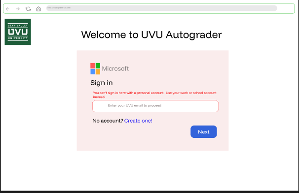

# Roles:
Since the system implements role-based access control (RBAC), the **login page remains the same for all users**. After authentication, the application determines the user's role and dynamically adjusts the interface. The navigation bar and available features change based on permissions assigned to that role (e.g., student, TA, instructor/admin).

## Student:
- SView the courses that they are enrolled in for the current semester (grid and list view)
- Submits code (upload .zip files) with maximum upload of 5 times an hour 
- View rubric 
- View constraints 
- View feedback, numbers of test passed and failed and score 

Link to figma prototype: https://www.figma.com/proto/GLPFmoiaQEM5eJjru86PFu/uvu_autograder?node-id=247-379&t=Cq3choHIglkhpbEO-1&scaling=min-zoom&content-scaling=fixed&page-id=112%3A372&starting-point-node-id=247%3A379

Note: `Code Viewer` and `Test Result` panel can be scrolled vertically in the prototype

If the student uses personal email, this will pop up: 

. 

If they try to create an account using "Create one" option in there, it will pop up a message telling them to contact school IT. 

Note:
+ **Sandbox for student:** Compliant with the backend suggestion to use Monaco, I have implemented it as a read-only code viewer. I chose this approach because I believe we don't need a fully functional in-browser IDE that executes code and dynamically integrates with isolated rubrics since it will require significant infrastructure.For now, the sandbox for student provides panels for code viewer, terminal output, feedback and test result. Students cannot edit code here so they need to make changes locally and re-upload their files as needed. 
Each assignment loads its corresponding rubric configuration from the backend. When a student selects an assignment, the UI updates immediately to display the relevant requirements, and the autograder backend determines and executes the correct test suite against the submitted file.

## Admin/Instructor:
- Manage courses 
- Monitoring (token limit, system limits, upload limit)
- User management tools (assign instructor, TA) 
- Create courses 
- Create sections 
- Deactivate courses 
- Deactivate sections 
- Create assignments 
- CRUD rubrics 
- CRUD constraints 
- Set a deadline for assignments 
- CRUD test cases 
- Download assignment config 

Link to figma prototype: https://www.figma.com/proto/GLPFmoiaQEM5eJjru86PFu/uvu_autograder?node-id=480-890&t=tkdZgWKk1N7cqLx9-1&scaling=min-zoom&content-scaling=fixed&page-id=377%3A1357

Note:

+ **Sandbox for instructor/TA:** still need clarification. For now, this is the draft. 
Link to figma: https://www.figma.com/proto/GLPFmoiaQEM5eJjru86PFu/uvu_autograder?node-id=548-1891&t=xJAsxGnj1YOSTySS-1&scaling=min-zoom&content-scaling=fixed&page-id=60%3A122&starting-point-node-id=548%3A1891

## TA:
- View assigned courses and sections (grid and list view)
- View only (rubric, constraints, deadline) of each assignment 
- Run test cases 

Link to figma prototype: https://www.figma.com/proto/GLPFmoiaQEM5eJjru86PFu/uvu_autograder?node-id=568-2297&t=dsu440ds4eG8aJbF-1&scaling=min-zoom&content-scaling=fixed&page-id=377%3A1358

