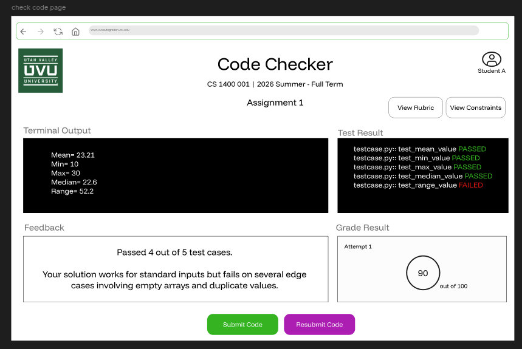

# Implementation Questions (UI/UX PDF vs Jaxon Backend Docs)

This file captures unresolved differences between:

- `frontend_implementation/UVU_autograder_UI_UX.pdf`
- `backend_implementation/jaxon_implementation/JL_AGv1_decisions.md`
- `backend_implementation/jaxon_implementation/JL_AGv1_technical_specs.md`
- `backend_implementation/jaxon_implementation/JL_AGv1_backlog.md`

## Open Questions

1.  **Auth flow: form login or Microsoft OAuth only?**  
     The UI/UX PDF shows `username/password` login boxes, while backend docs lock M1 to `NextAuth + Microsoft OAuth` with `@uvu.edu` restriction.

    **Jaxon**: The current idea is to use Microsoft OAuth until IT authorizes official UVU login.

    **Keomony**: Thanks for pointing this out. It seems Microsoft OAuth has a different action and interface than the form login. I'll modify it using myUVU log in sample:

    ```text
        +----------------------+
        | School Email         |
        | [______________]     |
        |                      |
        | Continue             |
        +----------------------+
    ```

2.  **Student identity persistence: are students stored as accounts?**  
     The UI/UX PDF includes “add people (TA) and students,” but backend docs lock M1 to session-only student access with no persistent student profile.

    **Jaxon**: Until we integrate with Canvas, we don't need students to have accounts. They only "log in" to authenticate. We are storing the minimal amount of student information.

    **Keomony**: what I had in mind is that not all students can access the course autograder. Let's say: - Student A registers for CS1400 which will use autograder, so after log-in, the student will see CS 1400 on the dashboard where s/he can click on it, select assignment number and upload the zip files to check codes. - Student B register for CS 2300 which doesn't use autograder, so after log-in, the dahsboard is blank.

    So, I am thinking of is:
    Students will authenticate using Microsoft OAuth, but we will not implement full persistent student accounts/profiles.
    However, the system still requires minimal authorization data to determine which courses a student can access. After login, the backend can check the student’s Microsoft email/ID against a lightweight course-enrollment mapping (e.g., authorized student list for each course).

    This allows:
    - students enrolled in supported courses to see those courses on their dashboard
    - students not enrolled in supported courses to see an empty dashboard

    We will store only the minimal information necessary for authentication and course authorization, not long-term student profiles or persistent submission history. Maybe we'll only store something like this:

    ```text
    `Minimal table:

    authorized_students (
        email,
        course_id
    )


    or imported roster:

    `course_enrollment (
        microsoft_oid,
        course_id
    )
    ```

    **Jaxon:** I think that's a good idea. I'll implement it in my docs. We just need to ensure we're not storing student code.

3.  **Attempt/history UX in sandbox: in-session only, or retained history?** ✅ **RESOLVED**

    **Decision**: Strict session-only with no persistent backend storage. Students see only in-session feedback on screen, which is destroyed when the session ends or processing completes.

    **Rationale**:
    - **Jaxon locked zero-retention**: "We are not retaining attempt history on either side. We can't store student data."
    - **Backend spec confirms**: `FR-03.5` locks "Student projected results are destroyed when processing completes or the session exits"
    - **FERPA/Privacy**: No persistent attempt history, submission metadata, or analytics storage protects student privacy and keeps M1 scope focused on real-time feedback only
    - **Implementation**: Sandbox feedback is on-screen only (React state); once the student's session ends, all attempt data is destroyed

    **What this means**:
    - ✅ Students see live feedback during current upload
    - ❌ No attempt history available after logout or refresh
    - ❌ No analytics or metadata about prior attempts
    - ❌ No feature to "view past submissions"

4.  **Downloadability of raw submissions: allowed for staff, or disallowed by retention/security policy?**  
    The UI/UX PDF includes “download zip files/code submission.” Backend docs lock export outputs to grade CSV + per-student HTML feedback ZIP and strict cleanup of student artifacts.

    **Jaxon**: We shouldn't need to download code submissions, unless you can think of a reason.

    **Keomony**: I think you are right. We may not need this, but I'll ask Dominic and Vebjørn if they think we need it, or if they have any suggestions. The thing is I keep getting confused about what data will be stored and what not. So that is why I somwhow mix up the featues. But currently, this feature is only what I considered to include. I don't think it is being used for now.

    **Clarification: What Gets Stored vs. What Doesn't**

    To clear up the confusion, here's what M1 will store persistently and what will NOT be stored:

    **❌ NEVER STORED** (Zero-Retention):
    - Raw student code files or submission ZIP contents
    - Temporary extracted files from official or sandbox runs
    - Detailed grading feedback bodies or traceback outputs
    - Judge0 submission/result artifacts (deleted immediately after retrieval)
    - Sandbox attempt data or submission metadata
    - Per-student HTML feedback files (deleted after official export is packaged)

    **✅ WILL BE STORED** (Minimal Metadata Only):
    - Official run CSV export (grades + identifiers) - staff can download after run completes
    - Official run master ZIP containing HTML feedback (staff can download after run completes)
    - Assignment configuration (config.json), test cases, and model solutions (staff assets, not student data)
    - Run metadata (timestamps, submission counts, failure summaries, sanitized Azure token usage)
    - MOSS report URL for official runs (staff review link only, not student code)
    - Canvas roster enrollment mapping (student email → course authorization only, not submission history)

    **Staff Export Workflow**:
    1. Staff uploads Canvas ZIP → official run begins (ephemeral processing)
    2. System grades and generates results
    3. Results packaged as CSV + HTML ZIP for download (staff-facing export)
    4. After download: temporary files and detailed artifacts destroyed
    5. Staff retains: downloaded CSV/HTML artifacts (their responsibility, not the system's)

    **Why No Code Download**:
    - The system never needs to re-expose raw student code to staff
    - Feedback is already packaged as HTML (code issues are explained in feedback)
    - MOSS can run during the ephemeral batch if plagiarism review is needed (staff gets URL)
    - Keeping student code off persistent storage reduces FERPA/privacy risk

5.  **Rubric authoring source of truth: UI rubric editor vs config/test-case model?** ✅ **RESOLVED**
    **Decision**: M1 uses a backend-canonical config/test-case model. The frontend should provide a comprehensive instructor-facing wizard for all instructor-relevant grading configuration, and that UI generates and persists the canonical app-owned `config.json`.

    **Rationale**:
    - **Backend alignment**: Existing Jaxon backend docs already treat the app-owned `config.json` and `TestCase` model as canonical
    - **M1 simplicity**: Wizard-first authoring is safer and easier to validate than making a separate UI rubric model authoritative
    - **Instructor completeness**: Everything relevant to the instructor should be editable through the frontend UI, so raw JSON editing should not be the primary workflow
    - **Scoped JSON support**: M1 only needs `config.json` import/export support, not a primary raw JSON editing experience
    - **Canvas metadata scope**: M1 does not require Canvas assignment metadata import; instructors can set assignment metadata manually
    - **Permission caution**: Whether IAs may author or edit assignment config remains deferred and should not be locked by this question

    **What this means**:
    - ✅ The frontend wizard is the main authoring workflow
    - ✅ The backend `config.json` remains the canonical persisted artifact
    - ✅ Instructors can edit all instructor-relevant config fields through UI
    - ✅ `config.json` import/export remains supported
    - ✅ Assignment metadata can be entered manually; Canvas metadata import is not required for M1
    - ❌ Raw JSON editing is not required as a primary M1 workflow
    - ❌ IA rubric/config authoring permissions are not finalized here

6.  **Inline LLM code annotations: M1 commitment or post-M1 enhancement?** ✅ **RESOLVED**
    **Decision**: M1 does **not** include inline LLM annotations in the code editor. Instead, the student sandbox shows an **LLM feedback textbox** next to test-case results, automatically after each run.

    **Rationale**:
    - **Scope control**: Deferring inline annotation UX keeps M1 implementation simpler while still delivering AI-assisted guidance
    - **Wireframe fit**: The current code-checker panel already supports side-by-side test results and feedback areas
    - **Trust model**: LLM feedback is explanatory only; pytest/test outcomes remain the grading source of truth
    - **Audience scope**: M1 LLM feedback textbox is for student sandbox only, not staff official-run review

    **What this means**:
    - ✅ Monaco remains the canonical M1 editor/review surface
    - ✅ Student sandbox auto-displays an LLM feedback textbox after each run
    - ✅ Textbox content explains failures/suggestions but does not alter score or pass/fail status
    - ❌ Inline in-editor annotation markers are deferred to post-M1
    - ❌ Staff-facing official-run flows do not require this textbox in M1

    

## Clarification Notes for Frontend Team

- **Framework/language baseline (PDF p.7):** Use **Next.js + React + TypeScript** for M1. HTML/CSS are output/styling layers, but implementation should be TS/TSX (not plain JS pages).
- **Validation baseline (PDF p.7):** Prefer schema validation (for example Zod) for frontend form/input validation.
- **Retention baseline (PDF p.3):** “History/attempts before session end” is session-lifetime UI only. Do not implement persistent student attempt history for M1.
- **Download baseline (PDF p.6):** Do not add direct student-code download UX by default in M1; canonical export remains staff grade CSV + HTML feedback ZIP.
