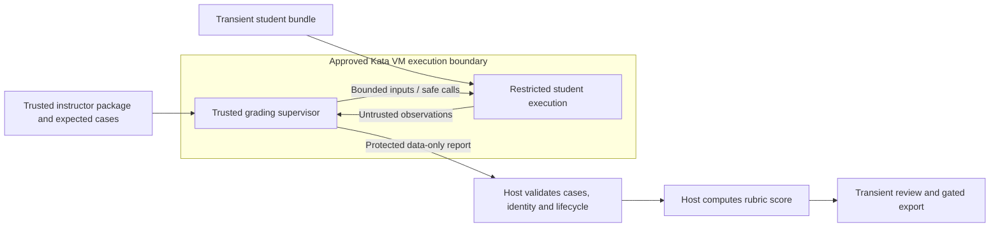

# Autograding platform research and UVU improvement proposal

Research date: **2026-10-06**. UVU baseline: commit `65126ae49bb2307c8d5b6c98e0d62cd48d698bd5`. Unrelated frontend work was present at the start, and additional unrelated documentation/UI changes appeared during research; all were left untouched.

## Recommendation

Keep the current FastAPI/Next.js, Canvas-batch and Judge0/Kata architecture for the controlled pilot. Borrow the upstream projects' strongest mechanisms: tested assignment releases, precise execution outcomes, explicit result contracts, consistent manual review and independent reconciliation. Replacing the whole platform would introduce course/identity/history responsibilities that Canvas already owns and would conflict with our transient student-data design.

The most consequential finding is that **host isolation, reliable scoring and grading reproducibility are separate properties**. Kata protects a host boundary; it does not make a pytest process that imports student code a trusted result producer. A run snapshot stabilizes an executing batch; our current implementation creates it at first execution, leaving a queued batch exposed to intervening assignment edits. A correct reference solution passing tests does not establish that incorrect solutions fail. These are better investments than acquiring another course platform.

This document is a research reference and a set of proposed decisions. It does not authorize a deployment, change product/privacy policy, implement features or create a second task tracker. Active proposals are tracked as [GitHub Issues](https://github.com/UVU-Autograder/autograder_v1/issues), rather than tracked in parallel here.

## Reading map

| Profile | Principal contribution | Most relevant caution |
| --- | --- | --- |
| [Submitty](submitty.md) | Grading phases, visibility rules, reusable rubric marks | Broad course/student state; Docker and jailed execution are distinct paths |
| [PrairieLearn](prairielearn.md) | Reproducible variants, grader self-tests, external result protocol | Persistent attempts; mixed community/enterprise/component licensing |
| [Autolab](autolab.md) | Execution-service separation, staged feedback, source annotations | Multiple score-editing authorities; Tango implementation is separate |
| [Otter-Grader](otter-grader.md) | Instructor/student package generation and public local checks | Docker defaults, host object deserialization and notebook complexity |
| [Piston](piston.md) | Versioned runtimes, compile/run budgets, process diagnostics | Execution only; privileged checked-in deployment differs from Kata |
| [Anubis](anubis.md) | Commit-driven pipelines, typed progress, infrastructure reapers | GitHub/IDE/history scope and substantial Kubernetes operations |

Each profile contains implementation-level observations, immutable upstream links, project-specific adaptations, non-fit areas and proposed experiments. Read the proposal below for the combined design and sequence.

## Method, provenance and limits

I read our committed architecture, authoring, operating, AI, privacy and backlog documents, then traced relevant assignment, grading, ingestion, scheduling, retention and review code. For upstream analysis I cloned one repository at a time with `git clone --depth 1`, inspected documentation plus implementation and representative tests, wrote its profile, deleted the clone and verified that its path no longer existed before proceeding. Each clone was absent before the next clone began. All six cloned working trees and their `.git` directories were removed.

| Order | Repository | Inspected commit | Commit date | Clone lifecycle |
| --- | --- | --- | --- | --- |
| 1 | [Submitty/Submitty](https://github.com/Submitty/Submitty/tree/df165f676c2d892adfd1343ac82e6ee490b07152) | `df165f676c2d892adfd1343ac82e6ee490b07152` | 2026-10-02 | Deleted before PrairieLearn |
| 2 | [PrairieLearn/PrairieLearn](https://github.com/PrairieLearn/PrairieLearn/tree/3d750c422e29a444b22d77bbe9e94fece7ea89e6) | `3d750c422e29a444b22d77bbe9e94fece7ea89e6` | 2026-10-06 | Deleted before Autolab |
| 3 | [autolab/Autolab](https://github.com/autolab/Autolab/tree/674efe9deac197e108a426c873beb7c5f912b25f) | `674efe9deac197e108a426c873beb7c5f912b25f` | 2025-10-21 | Deleted before Otter |
| 4 | [ucbds-infra/otter-grader](https://github.com/ucbds-infra/otter-grader/tree/190c1a4c3e97fff6f6469b7a506ca8d073384a64) | `190c1a4c3e97fff6f6469b7a506ca8d073384a64` | 2026-10-01 | Deleted before Piston |
| 5 | [engineer-man/piston](https://github.com/engineer-man/piston/tree/de2b365ac759670a3a0d13ea208a0869a92c7e64) | `de2b365ac759670a3a0d13ea208a0869a92c7e64` | 2026-07-31 | Deleted before Anubis |
| 6 | [AnubisLMS/Anubis](https://github.com/AnubisLMS/Anubis/tree/894ed020997ff22235e0d4b42a6f5dd9ea14f5e7) | `894ed020997ff22235e0d4b42a6f5dd9ea14f5e7` | 2026-09-15 | Deleted after analysis |

Temporary clones lived under `C:\Users\Jaxon\AppData\Local\Temp\uvu-autograder-research-20261006`, outside this repository. The clones and empty temporary parent directory were removed using native PowerShell operations against verified paths. Only analysis documents remain in the project.

This is an in-depth source/design review, **not** a benchmark, running deployment evaluation, license opinion or complete security audit. Upstream tests were read, not executed. I installed no upstream dependencies, ran no upstream code and accessed no real student data. Tango, Isolate and external package registries are dependencies of the requested repositories; they were not separately cloned/audited. Source defaults and comments do not prove effective deployed behavior. Commit recency does not establish support, safety or abandonment. Proposed acceptance tests below are future checks, not passing evidence from this research.

The original descriptions are useful starting categories, but need qualification. Submitty includes C++ grading and non-Docker execution. PrairieLearn has both local and production-oriented grader paths and edition-specific content. Autolab's Tango backend behavior cannot be verified by reading only the Rails client. Otter's interoperability does not imply Canvas API write-back. Piston is a runtime executor, with installation-dependent languages, rather than a course grader. Anubis uses a full repository/pipeline/IDE workflow; a VS Code-like browser environment is not a trivial editor integration.

## Our baseline: what should be preserved

| Existing capability | Verified source or authoritative constraint | Implication |
| --- | --- | --- |
| Canvas owns content and official grades | [System](../system.md) | Avoid a second course/LMS authority |
| Anonymous public sandbox with transient results | [Sandbox schemas](../../backend/app/domains/sandbox/schemas.py), [Considerations](../considerations.md) | Avoid student accounts/history as an incidental dependency |
| Canonical config, stable scoring keys, manual items/groups and completion requirements | [Assignment schemas](../../backend/app/domains/assignments/schemas.py) | Extend this model; do not add a competing rubric language |
| Preflight and reference-model workflow | [Specification engine](../../backend/app/domains/assignments/engine.py), [authoring guide](../guides/assignments.md) | Expand calibration rather than start validation from scratch |
| Automated score calculation on the host | [Result parser](../../backend/app/domains/grading/result_parser.py) | Keep points/config authority outside submitted code |
| Execution tickets, ownership tokens, official checkpoints and bounded admission | [Admission](../../backend/app/domains/runs/queue_admission.py), [dispatcher](../../backend/app/domains/runs/dispatcher.py), [official execution](../../backend/app/domains/runs/official_execution.py) | Preserve duplicate/stale-result protections and two-slot host ceiling |
| Separate execution and cleanup lifecycle | [Executor](../../backend/app/domains/grading/executor.py), [cleanup worker](../../backend/app/domains/runs/cleanup_worker.py) | Engine disposal remains part of success |
| Official manual-review/export gate and section authorization | [Run routes](../../backend/app/domains/runs/router.py), [review service](../../backend/app/domains/runs/service.py) | Preserve server-side authority when expanding UI workflows |
| Judge0/Kata/QEMU on university workstation | [Kata overlay](../../docker-compose.kata.yml), [workstation guide](../guides/workstation.md) | A new engine is a new isolation/deployment decision |
| AI explains validated public failures, never determines grades | [AI guide](../guides/ai.md), [guardrails](../../backend/app/integrations/ai/guardrails.py) | Better deterministic feedback comes before more AI scope |
| Student detail access ends at 23h; physical deletion by 24h | [Considerations](../considerations.md), [retention](../../backend/app/domains/runs/retention.py) | New annotations, timelines and generated artifacts must share that lifetime |

Current shortcomings are narrower than “we need a mature autograder.” The following ones were directly visible in inspected code; their impact still needs targeted reproduction:

- The generated runner executes pytest and student imports in one interpreter, then emits its result through stdout. Host-side point calculation protects configuration authority but trusts the received test outcomes. See [runner generation](../../backend/app/domains/grading/runner_gen.py).
- The parser supplies defaults and converts values without a full versioned wire schema or a trusted expected-case inventory. A syntactically valid result can still omit cases or contain unsupported entries. See [parsing/scoring](../../backend/app/domains/grading/result_parser.py).
- Official intake stores the ZIP and marks dispatch ready; the grading snapshot is made later in the first execution step. Configuration/artifacts can change while the batch waits. See [intake](../../backend/app/domains/ingestion/engine.py) and [execution](../../backend/app/domains/runs/official_execution.py).
- Runtime signals/nonzero exit statuses are grouped into timeout in the Judge0 map. See [engine status mapping](../../backend/app/integrations/judge0/client.py).
- The custom Python image installs important dependencies without version pins; runtime identity is not included in the official grading snapshot. See [image](../../judge0.Dockerfile).
- Artifact loading can continue after a load failure, and artifact filenames are flattened to basenames. Missing files and duplicate/colliding destinations need explicit package validation. See [artifact preload/injection](../../backend/app/domains/grading/engine.py).
- Manual writes are serialized under the retention guard, but there is no client-supplied optimistic revision in the inspected update path. Serialization prevents simultaneous file corruption; it does not prevent a later stale edit from overwriting a prior edit. See [review mutation](../../backend/app/domains/runs/service.py).
- Canvas normalization resolves filename collisions by file size. A larger file is not proof of the intended version. See [extractor](../../backend/app/domains/ingestion/extractor.py).
- Export readiness currently checks completed run/manual scoring. It does not independently establish that every automated result is valid and every intake ambiguity resolved. See [manual progress/export readiness](../../backend/app/domains/runs/service.py).

Our [AI evaluation documentation](../../backend/eval/README.md) already records synthetic mutations that the grader did not catch, and explains that case generation uses a local subprocess in place of Judge0. Treat those as candidates for current verification, not proof that every listed gap still exists today. Importantly, the generator drops undetected mutations from AI cases: an AI dataset cannot serve as a complete negative-test inventory for the grader.

## Capability comparison and investment judgment

These judgments are relative to UVU's current pilot, not universal rankings. “Fit” means an independently implemented pattern fits our constraints; it does not mean a drop-in integration exists.

| Dimension | Best references in this set | UVU adaptation | Judgment |
| --- | --- | --- | --- |
| Assignment authoring | Otter, PrairieLearn | Build/release package plus synthetic calibration | High value now |
| Manual consistency | Submitty, Autolab | Generic marks, anchored comments, revision checks | High value after scoring foundations |
| Student diagnostics | Autolab, Piston, PrairieLearn | Typed outcomes and deterministic authored hints | High value now |
| Runtime identity | Piston, Otter | One pinned approved Python profile | High value now |
| Feedback visibility | Submitty, Otter | Server projection across API, HTML and AI | Useful when an instructor needs it |
| Durable execution | Anubis, PrairieLearn, Submitty | Extend our leases/reconciliation; keep PostgreSQL authority | Reinforce existing design |
| Parameterized practice | PrairieLearn | Seeded instructor tests first; transient practice variants later | Incremental experiment |
| Package interoperability | Otter, PrairieLearn, Autolab | Explicit import subset with conversion report | Conditional on a real course package |
| Compiled/multiple languages | Piston, Autolab/Tango, Submitty | New approved runtime profiles and phase semantics | Future course-driven work |
| Git intake/full IDE | Anubis | Separate approved ingestion/workspace project | Defer for pilot |
| Persistent mastery/analytics | PrairieLearn, Anubis | Transient cohort diagnostics and operational aggregates only | Full feature requires policy change |
| Canvas synchronization | PrairieLearn | Approval, identity mapping, grade preview/idempotency | Deferred; preserve current exports |

### Build, reuse or replace

**Independent implementation of selected patterns** is the recommended path. It preserves our existing domains and policy, avoids large new runtime dependencies and lets us calibrate behavior against the 17 CS1410 seed packages. It still costs engineering and instructor review; “borrowing an idea” does not mean copying code without maintenance.

**Importers/adapters** are sensible only when a named instructor has an existing package worth importing. An Otter public-test package or a PrairieLearn external grader has different test IDs, fractional scores, environment requirements and visibility rules. A converter must identify what it preserved, transformed or rejected. Do not silently translate an unsupported grader into a superficially similar UVU rubric.

**Replacing the execution engine** retains most of our application work and adds deployment, result and disposal compatibility work. Piston/Tango should compete on a measured unmet requirement, such as a needed compiled language, rather than the appeal of a smaller API. Keep Judge0 behind the existing adapter until such a requirement exists.

**Replacing the whole platform** is a university-scale decision about course authority, student identities, persistent storage, support and staffing. Submitty/PrairieLearn/Autolab/Anubis could warrant that decision in a different institutional scope. Nothing in this inspection demonstrates that migrating now would reduce our pilot's cost or risk.

## Proposed improvements in detail

### 1. Make grading outcomes verifiable and reject incomplete result data

Sources: PrairieLearn's external result contract, Piston's process outcomes, Autolab's platform/engine separation. Implementation targets: [runner](../../backend/app/domains/grading/runner_gen.py), [executor](../../backend/app/domains/grading/executor.py), [parser](../../backend/app/domains/grading/result_parser.py), [grading engine](../../backend/app/domains/grading/engine.py).

Introduce a versioned, data-only execution envelope. It should carry execution phase/status, protocol version, runtime/package identity, bounded diagnostics and a list of case results with stable IDs and allowed outcomes. The platform supplies the expected collection manifest from trusted assignment validation. The host verifies exact membership, duplicate IDs, marker-to-key mappings, required setup/teardown reporting and declared collection/execution completion before calculating points. Counts and totals should be derived, not trusted independently from submitted summary values.

A case that is absent, skipped unexpectedly or missing teardown evidence cannot silently stand in for a completed check. Distinguish collection failure, test-harness failure and a normal assertion failure. Reject invalid shapes, non-finite numbers, impossible durations, unknown protocol versions and oversized results. Make zero-test configurations or intentionally optional cases explicit at validation time. Preserve all-of scoring for existing keys: every expected case under a key must pass.

This structural work is worthwhile, but it **does not authenticate an untrusted producer**. Our runner and student code share an interpreter. Malicious or simply invasive code may interfere with imports, pytest hooks, output capture, signals or result state. Putting an HMAC secret in that same interpreter would not create a trustworthy boundary. A dedicated result filename alone is also insufficient if student code can write it.

A stronger harness needs a trusted supervisor and separate student execution with enforced OS/process capabilities. Keep both execution and trusted tests inside an approved VM boundary, keep the report channel inaccessible to the student process, restrict student file access and let the supervisor produce the attested outcome. For stdin/stdout programs this can be a constrained subprocess protocol. Function/class assignments need a deliberate safe call/observation protocol that supports their course semantics without loading student objects on the host or deserializing pickle. Pygame and runtime protocols add compatibility work; prove a narrow assignment first before generalizing.

The proposed boundary below is conceptual and **not implemented**. Separate process labels only become a trust boundary when enforced permissions prevent the student process from reading/modifying supervisor memory, assets, credentials and reports.

Use a time-bounded synthetic feasibility experiment to establish what Judge0 packaging/Kata can enforce. Record limits where in-process tests are still required, and do not promise test secrecy or tamper-proof scoring for that path. Keep AST concept checks as pedagogical validation, not as a sandbox or comprehensive anti-tampering system.

Acceptance evidence: malformed/duplicate/missing reports fail closed; unexpected skipped tests cannot earn points; setup/teardown defects are visible; spoofed stdout cannot be treated as an attested result; synthetic code cannot modify the supervisor's result state or see grading credentials. Also verify normal class/function tests, student-authored pytest helpers and Pygame behavior remain pedagogically equivalent. No exploit against the current runner was executed in this research.

### 2. Freeze the complete grading package before a run becomes dispatchable

Sources: Otter's generated packages, PrairieLearn's variant/content identity, Autolab's package uploads. Targets: [assignment config/history](../../backend/app/domains/assignments/models.py), [intake](../../backend/app/domains/ingestion/engine.py), [official execution](../../backend/app/domains/runs/official_execution.py), [artifact resolution](../../backend/app/integrations/artifacts/resolver.py).

Move official package capture to admission, before `OfficialDispatch.ready` becomes true. Capture config, effective concepts, grading/support artifact bytes and digests, public description/feedback metadata, expected-case inventory, runner protocol and effective runtime profile. Models stay out of student executions. Package identity should refer only to instructor assets and approved runtime metadata; individual student hashes are transient detail.

Admission needs coherent failure handling across database and filesystem. Validate/load the package, write it atomically in the guarded run workspace, retain the ZIP under its existing lifetime, and make dispatch ready only after required artifacts are present. If a step fails, the run remains undispatchable and cleanup reconciles partial files. Avoid a database transaction or shared scheduler lock held over network/image operations. Prefer a published immutable instructor package reference when release storage is available.

Address missing assets and basename collisions before execution. The current loader can continue after an artifact read failure; a publishable package should reject missing required tests/support rather than run a reduced suite. Distinguish instructor bundle names from student names and define which starter/support files legitimately share paths. Use a canonical manifest encoding for digests, preserving binary assets and rejecting ambiguous duplicate paths.

This supplies an immediate improvement independently of full course release management. Then connect it to the existing planned master-course publication: drafts are editable, releases immutable, sections explicitly adopt releases, and existing official batches remain pinned. A release change notice should summarize scoring/artifact/runtime changes, not silently update section grades. Rollback selects a previous instructor release for new runs; it cannot recreate student detail already deleted.

Acceptance evidence: admit a batch, modify assignment/config/artifacts/concepts/runtime selection while it waits, and confirm every student uses the originally admitted package. Crash between package write and dispatch readiness and verify safe recovery. Missing/colliding assets reject admission. Retention removes all run-specific package copies along with official detail; instructor release assets survive under the persistent backup policy.

### 3. Turn grader calibration into an assignment release gate

Sources: PrairieLearn question self-tests, Otter solution validation, Submitty's explicit case/config structure. Targets: [specification engine](../../backend/app/domains/assignments/engine.py), [seed packages](../../backend/app/db/seeds/), [mutation catalog](../../backend/eval/mutations.py), [validation tests](../../backend/tests/test_assignment_validation.py), [staff editor](../../frontend/features/assignments/components/editor/assignment-editor.tsx).

Build an instructor-owned calibration manifest with named synthetic cases, expected item outcomes and expected failure categories. Include a canonical model and alternate valid implementations, known mistakes, empty/boundary inputs, wrong interfaces, concept-policy cases and required manual criteria. Keep failing mutations in this inventory even when no existing test catches them. Show them as unresolved calibration gaps instead of discarding them from the report.

Static preflight should validate syntax, known markers, unmapped scoring keys, file paths, duplicate destinations, dependency availability and all required package bytes. Real collection inside the approved runtime should create the expected-test inventory. Dynamic calibration should execute representative cases through Judge0, because the local AI generator deliberately replaces that step and cannot prove runtime parity.

The report should say which requirements have positive, negative and boundary evidence; whether outcomes match expectation; which mutations survive; and whether two repeated runs agree. Do not force instructors to author many synthetic files before getting basic feedback: start with existing models and selected current mutations, then add coverage for the pilot's highest-risk requirements.

Student-authored tests deserve their own calibration: passing submitted tests, deliberately failing tests, no discovered tests, shadowed pytest/imports and prohibited file access. A “tests exist” check is insufficient. Likewise, headless Pygame state checks do not satisfy manual appearance/interaction criteria. Course owners should review exact-output requirements so tests do not reject valid solutions for accidental formatting choices.

Store only instructor fixtures and aggregate/sanitized validation reports in persistent assets. Validation runtime files and any sensitive debugging traces follow the current cleanup boundary. A reference case can be synthetic yet still require short-lived execution artifacts; synthetic provenance does not justify unbounded worker storage.

Acceptance evidence: each pilot package's model passes; curated wrong cases fail the intended key; equivalent valid solutions pass; concept warnings are deliberate; calibration reports surface gaps rather than treating a green model as comprehensive readiness. Instructor acceptance remains a separate judgment and existing pilot prerequisite.

### 4. Make runtime behavior reproducible and failures actionable

Sources: Piston's runtime/version/resource contract and PrairieLearn's phase timings. Targets: [Judge0 image](../../judge0.Dockerfile), [settings](../../backend/app/core/settings.py), [client](../../backend/app/integrations/judge0/client.py), [runtime tests](../../backend/tests/test_judge0_custom_runtime.py), [sandbox results UI](../../frontend/features/assignments/workspace/code-results.tsx).

Create one approved Python profile before a general runtime registry. Record exact Python/package versions and the image digest, language ID, limits, networking rule, locale, runner version and supported course capabilities. Probe actual package imports and a tiny synthetic execution at deployment validation. Pin dependencies after calibration, then update them deliberately with known-good/known-bad cases. The checked-in image's Buster archive workaround is a maintenance concern that deserves an upgrade feasibility check; adding a second engine built on an old base does not solve it.

Normalize memory/time units at the adapter boundary and document effective CPU, wall, collection, per-case and end-to-end limits separately. Our runner's Python signal alarm is a convenience timeout, not the sole external enforcement. Collection hangs and suppressed signals need an engine-enforced ceiling. Derive slot/lease durations from the documented longest operation and cleanup budget, preserving stale-owner rejection.

Replace coarse timeout mapping with a stable taxonomy: invalid bundle, student syntax/import error, assertion failure, runtime crash, confirmed timeout, confirmed memory/output/process limit, collection/harness defect, engine unavailable, protocol failure and cleanup failure. When evidence is insufficient, show an unknown execution failure instead of guessing. Keep student errors actionable and staff defects explicit; an infrastructure outage should not automatically become an earned zero.

Add bounded capture for student stdout/stderr and assert diagnostics, with clear truncation indicators. Machine results need their own bound/channel so student prints cannot consume the entire result allowance. Preserve Unicode and invalid-encoding handling. Do not install new dependencies over the network for each submission; image preparation belongs to staff operations.

Acceptance evidence: correct classification for representative synthetic failures, bounded output under runaway printing, consistent repeated models, deployed runtime identity matching the package, and verified networking/resource enforcement through Kata. Keep the current two execution slots until host measurements justify increasing them.

### 5. Make official export readiness reflect result validity and intake certainty

Sources: Autolab's separation of score authority and presentation; the broader platforms' explicit submission/version state. Targets: [Canvas extractor](../../backend/app/domains/ingestion/extractor.py), [intake](../../backend/app/domains/ingestion/engine.py), [review service](../../backend/app/domains/runs/service.py), [export routes](../../backend/app/domains/runs/router.py), [feedback formatter](../../backend/app/domains/runs/feedback_formatter.py).

Provide an intake report that separates recognized submissions, unmatched entries, multiple candidate versions, path/name normalization and collisions. A filename collision currently keeps the larger file; that heuristic should become a visible ambiguity with a staff decision or a narrowly documented deterministic rule. Preserve candidate data only in the transient run workspace. Do not save student filenames in persistent audit events.

Tie each graded bundle to an explicit transient source selection. If archives contain more than one version for a Canvas user, do not accidentally combine files from different submissions. Validate matching against the authorized course/section where approved data is available; filename shape alone is not a roster verification. Avoid introducing a new roster synchronization service just to implement a collision report.

Export readiness should require a valid terminal automated result for each included submission, all required manual items complete, and resolved intake ambiguities. For infrastructure/harness/protocol failures, offer retry or instructor adjudication rather than silently exporting a numeric zero. Student failures can still earn instructor-defined outcomes. A documented override should show its effect and reason in transient review/export data, and must not pretend an execution succeeded.

Render an export preview with row count, identity mapping, base/extra-credit totals, manual completion and held submissions. Keep Canvas import and feedback distribution manual for the pilot. Check CSV encoding/escaping and spreadsheet interpretation of untrusted cells; ensure generated HTML remains escaped/sanitized. A downloadable feedback file is student detail and does not become a persistent learning record.

Acceptance evidence: synthetic ambiguous/versioned ZIPs cannot silently choose the wrong files; a smaller intended file is not discarded as inferior; unresolved infrastructure errors prevent automatic publication; manual zero remains distinct from unreviewed; preview, CSV and HTML agree; section access and expiry still apply to every path.

### 6. Add consistent rubric marks, source comments and stale-save protection

Sources: Submitty marks and Autolab annotations. Targets: [scoring-item schemas](../../backend/app/domains/assignments/schemas.py), [review mutation](../../backend/app/domains/runs/service.py), [review dialog](../../frontend/features/runs/components/student-inspect-dialog.tsx), [HTML feedback](../../backend/app/domains/runs/feedback_formatter.py).

Start with instructor-authored generic feedback templates and an optimistic revision on each transient review record. A stale update should return a conflict with enough current state to reconcile safely. Existing file locking remains necessary for atomicity; revision checks add protection against human stale views. Reviewer claim/lease UI is optional and should not itself establish authorization or score finality.

Add comments tied to an immutable submitted file, line range and scoring key. Use source location to explain a manual score. Keep one authority for points: comments initially carry no independent arithmetic. If reusable marks later affect points, show the derivation and explicit override behavior. Never have an invisible gradesheet override while annotations imply a different total.

Allow grading by criterion across submissions as well as by student when it reduces repeated context switching. Use existing filters to find unreviewed criteria and automated failures. Staff see saved/pending/conflict states clearly; keyboard navigation and accessible focus management matter more than extra dashboards. Bound comments and line selections on the server, and preserve IA permissions.

Persistent templates are instructor assets. Student comments, selected marks, reviewer-specific detail and bundle digests expire with the official run. Do not automatically promote a student-linked comment into a template bank. Exports use the snapshotted rubric and current authorized manual revisions consistently.

Acceptance evidence: two simultaneous reviewers cannot silently lose edits, score/feedback authority is clear, keyboard review works, changed assignment rubrics do not alter a batch, and all student-linked marks/anchors disappear at cleanup.

### 7. Improve deterministic feedback and add explicit visibility policy when needed

Sources: Autolab staged feedback, Submitty hidden details, Otter public checks and PrairieLearn rich results. Targets: [assignment schemas](../../backend/app/domains/assignments/schemas.py), [normalizer](../../backend/app/domains/grading/normalizer.py), [sandbox service](../../backend/app/domains/sandbox/service.py), [results UI](../../frontend/features/assignments/workspace/code-results.tsx), [AI prompt builder](../../backend/app/integrations/ai/prompts.py).

Show a concise explanation before raw details: what requirement failed, what evidence is available and a permitted next debugging step. Add optional instructor-authored hints keyed to scoring requirements. Reuse those definitions across browser results and exported feedback. Distinguish concept-policy warnings from correctness failures and projected automated points from manual criteria still pending.

Make comparison semantics explicit. Our generated I/O helper strips whitespace and drops blank lines; some assignments need exact text and others need numeric tolerance. Add reviewed helper modes such as exact text, normalized text and numeric comparison, defaulting to current behavior for compatibility. Let instructors preview the effect on known cases. Avoid a broad string-normalization setting that accidentally makes a broken output pass every task.

If hidden/official-only tests are requested, distinguish **execution selection**, **feedback detail visibility**, and **test-source secrecy**. These are independent. Implement one server projection consumed by API, HTML, downloads and AI input; stripping a React field does not protect another endpoint. Define defaults and snapshot policy with the package. Hidden traceback source, expected/actual I/O, assertion text and generated hints all need coverage.

Our current same-process harness cannot establish secret-test confidentiality from arbitrary student code. Complete the relevant isolation experiment before promising it. Also show practice score limitations when the official case set differs; do not describe a sandbox result as guaranteed final credit.

AI remains local, sandbox-only and explanation-only. It receives the same public failure projection and deterministic hint context, bounded/sanitized through existing tools. Invalid/unavailable AI still falls back. Do not use AI to detect whether grading is correct, repair scores, expose hidden tests or grade official runs as part of these improvements.

Acceptance evidence: useful feedback with AI down, no private details in any public projection, exact/normalized comparisons behave as documented, and instructors agree that hints guide without giving solutions. Update live/eval/training prompt parity only when the prompt contract changes.

### 8. Observe queue phases and cleanup using aggregate evidence

Sources: PrairieLearn timestamps, Anubis reapers and Submitty compatible workers. Targets: [run models](../../backend/app/domains/runs/models.py), [dispatcher](../../backend/app/domains/runs/dispatcher.py), [cleanup worker](../../backend/app/domains/runs/cleanup_worker.py), [audit logging](../../backend/app/core/audit_log.py), [load scripts](../../scripts/mock_sandbox_load.py).

Measure queue wait, preparation, engine execution, parsing/scoring, export packaging and disposal. Monitor retained official work, active/waiting slots, fairness, repeated infrastructure failure and overdue cleanup. Preserve current PostgreSQL/lease authority; Redis remains transport. A worker capability inventory is useful only after multiple profiles or hosts exist.

Keep detailed timelines in the transient workspace; persist bounded operational aggregates without identity, code, filenames or raw feedback. Avoid run/session/student IDs as long-lived metric labels. Decide whether assignment-level aggregates meet the approved scope before adding educational analytics. A pseudonymous per-student record or hash is still linkable detail, not automatically anonymous.

Use synthetic fault injection and the documented 200-submission-plus-sandbox acceptance workload. Check worker/broker interruptions, lost responses, duplicate messages, stale attempts, failed engine disposal, database outage and process restart. A completed finally block cannot cover a terminated process, so startup/periodic reconciliation must recover or report orphaned obligations. Do not claim exactly-once execution; aim for idempotent accepted effects and complete cleanup under at-least-once delivery.

Acceptance evidence: batch work completes within the existing 40-minute target while sandbox requests receive service, exports meet the two-minute target, ownership cannot exceed the host ceiling, and immediate Judge0/23h/24h cleanup behavior is independently verified. No capacity or throughput result is asserted by this research.

### 9. Offer reproducible public practice and package interchange selectively

Sources: Otter local checks and PrairieLearn deterministic variants. Targets: [seed assets](../../backend/app/db/seeds/), [assignment service](../../backend/app/domains/assignments/service.py), [workspace downloads](../../frontend/features/assignments/workspace/assignment-file-context.tsx).

Once package generation is trustworthy, export optional public pytest bundles with matching release/runtime metadata. They can reduce queue pressure for students already comfortable with local Python. Do not require a new client tool for all introductory students; compare actual setup/support burden. Public checks do not replace the server's official rubric and manual criteria.

Use deterministic seed sets first in instructor calibration. For random practice cases, define generator version, seed, bounded difficulty and session-local state. Keep official cohort difficulty comparable. Tests for rounding, representation and reproducibility are especially important for numeric problems. Persistent mastery/adaptive attempts remain outside the pilot.

An importer should accept a named supported subset of another format and produce explicit warnings/rejections. Validate scoring units, IDs, dependencies, hidden/public semantics and manual criteria. Arbitrary plugins, unreviewed Docker images and network package installation are not a safe “import” feature. A real pilot package is needed to establish whether an adapter is cheaper than authoring directly.

Acceptance evidence: student bundles contain no solutions/private tests, local checks and server public checks agree under the documented environment, version mismatch is visible, repeated seeds reproduce, and conversions preserve expected scores on synthetic cases.

### 10. Keep larger extensions conditional on course requirements and approval

Multi-language execution, notebook grading, GitHub submission, remote IDEs, Canvas write-back and persistent analytics each solve a different problem. Bundle none of them into “modernizing the autograder.” A course owner should identify the concrete use case, acceptance behavior and ongoing maintainer before selecting an upstream integration.

Compiled languages need compile/run phases, sanctioned toolchains, budgets, grader calibration and VM isolation. Notebooks need clean-kernel semantics, bounded rich output and safe rendering. GitHub requires approved external data/credential scope and verified events. IDEs add interactive network/storage/session budgets. Canvas write-back requires approved API/LTI scope, correct assignment/student mapping, previews, idempotency and failure reconciliation. Official AI or long-lived student histories require separate product/data authorization under [Considerations](../considerations.md).

These are research options, not authorized pilot changes. The existing institutional SSO/TLS/approval, instructor calibration and host-evidence work still precedes live official grading.

## Suggested decision sequence

This is sequencing guidance, not another active backlog or a calendar estimate. Complexity is relative to this repository and should be refined after the first narrow experiment.

| Sequence | Decision/output | Relative complexity | Depends on | Evidence to proceed |
| --- | --- | --- | --- | --- |
| Foundation A | Strict result envelope, expected cases, precise failure taxonomy | Medium | Existing runner/parser | Invalid or incomplete reports cannot produce publishable grades |
| Foundation B | Capture complete package at admission; validate required assets | Medium | Existing intake/snapshot/retention | Queued config changes and partial intake failures are deterministic |
| Foundation C | One approved pinned Python profile and real-runtime calibration report | Medium | Package identity | Models/negative cases agree in actual runtime |
| Integrity experiment | Trusted supervisor/student separation for one assignment style | High | A–C | Synthetic tampering/confidentiality tests and semantic parity establish limits |
| Publication safety | Intake ambiguity report and automated-validity export gate | Medium | A–C | Ambiguous bundles and harness failures cannot silently become official grades |
| Staff refinement | Revision conflicts, rubric templates and anchored comments | Medium | Stable snapshots/export authority | Reviewer agreement and edit-conflict evidence |
| Feedback refinement | Authored hints, comparison modes and optional visibility projection | Medium | A–C; integrity experiment for secrecy claims | Public JSON/HTML/AI leak checks and instructor acceptance |
| Operational evidence | Phase telemetry and recovery/disposal workload checks | Medium | Instrumented existing workers | Dated host evidence meets existing targets |
| Course expansion | Local bundles/importers/variants or another runtime | Medium to high | Named course need, stable packages | A real conversion/runtime case justifies maintenance |
| Institutional expansion | Git/IDE/LMS/history changes | High | Approved scope and operating owner | Separate product/data/deployment acceptance |

A practical first implementation slice is a synthetic three-assignment calibration vertical slice: freeze at admission, record runtime identity, validate expected cases, classify failures and hold invalid exports. Choose one simple I/O task, one class-heavy Dessert Shop task and one Pygame/manual task. Those expose different semantic and review needs before the design hardens around only a trivial script. Pursue the trusted-supervisor experiment alongside this foundation as a separate bounded design question within the existing tracker, without calling shape validation tamper-proof.

Do not postpone the existing institutional launch gates until all research ideas are implemented, and do not let new features substitute for them. Conversely, a narrow pilot should not describe an untested integrity property as established merely because deployment checks pass.

## Compatibility, rollout and contract ownership

Keep current scoring semantics by default. `AssignmentConfigV1` remains authoritative; derived database scoring rows continue to be projections. Prefer splitting a criterion into explicit scoring keys before introducing proportional partial credit. If a course needs weighted cases or fractional points, specify rounding, extra credit, completion thresholds, manual scores and Canvas export behavior together, with an explicit compatible schema evolution. Do not independently compute totals in the UI.

Draft new config fields behind defaults that reproduce existing assignments. Add a protocol version independently of config content versions: an assignment release number, a schema version and an execution-result version answer different questions. A minimum viable release manifest does not require a complete multi-version migration platform, but breaking config changes do require the existing deferred compatibility work to be resolved.

For database additions use Alembic. For REST/config changes regenerate [OpenAPI](../schemas/openapi.json) and [config schema](../schemas/config_v1.schema.json) with the [documented generators](../running.md#additional-checks), then update frontend types, editor validation and synthetic fixtures. Upgrade instructor release assets without rewriting already-running/queued snapshots. An old result must either be parsed under its supported version or rejected clearly; never guessed into a new contract.

Roll out to synthetic courses first, then instructor-accepted pilot packages under the approved live scope. Compare old/new scoring on curated synthetic cases and investigate every difference. Retain a known-good runtime/profile and instructor release for new runs. Avoid dual execution of real submissions as an unapproved retained research dataset. Any temporary evidence remains sanitized and governed by existing retention rules.

## Verification design for future implementation

| Layer | Appropriate evidence | What it cannot establish alone |
| --- | --- | --- |
| Parser/scoring unit tests | Known cases, duplicate/missing tests, schema limits, all-of/extra-credit behavior | Sandbox isolation or protected result production |
| Authoring/package tests | Required files, collisions, leak-free exports, calibration expectations | Effective host runtime/package identity |
| API/permission tests | Section grants, IA read-only boundaries, stale revisions, export gates | Real Entra/TLS deployment |
| UI/browser checks | Review navigation, conflict states, hints, score/export agreement | Backend authority when requests bypass UI |
| Real synthetic execution | Judge0/Kata capability, signals/limits, harness semantics and cleanup | Course-owner acceptance or institutional approval |
| Failure/recovery workload | Restart/redelivery/lost response/orphans, fairness and retention deadlines | Automatic multi-host failover, which we do not implement |
| Instructor calibration | Fair grading and useful feedback on permitted solutions | Broad coverage of untested code behaviors |

Extend the existing meaningful suites rather than mirror implementation details in new tests: [parser](../../backend/tests/test_pytest_parser.py), [grading executor](../../backend/tests/test_grading_executor.py), [assignment validation](../../backend/tests/test_assignment_validation.py), [ingestion](../../backend/tests/test_ingestion_extractor.py), [official pipeline](../../backend/tests/test_official_run_pipeline.py), [bounded dispatch](../../backend/tests/test_bounded_dispatch.py), [retention](../../backend/tests/test_official_retention.py), and [frontend browser tests](../../frontend/e2e/). Use isolated databases and synthetic submissions, as required by [Running](../running.md).

## Upstream reuse and maintenance boundaries

| Project | License metadata observed in inspected repository | Adoption implication |
| --- | --- | --- |
| Submitty | [BSD-3-Clause; third-party inventory](https://github.com/Submitty/Submitty/blob/df165f676c2d892adfd1343ac82e6ee490b07152/LICENSE.md) | Record file/component provenance before code reuse |
| PrairieLearn | [AGPL CE, enterprise-specific and differently licensed portions](https://github.com/PrairieLearn/PrairieLearn/blob/3d750c422e29a444b22d77bbe9e94fece7ea89e6/LICENSE) | Do not treat the monorepo as uniformly MIT or assume EE features are available in CE |
| Autolab | [Apache-2.0](https://github.com/autolab/Autolab/blob/674efe9deac197e108a426c873beb7c5f912b25f/LICENSE) | Tango and grader assets require separate provenance review |
| Otter | [BSD-3-Clause](https://github.com/ucbds-infra/otter-grader/blob/190c1a4c3e97fff6f6469b7a506ca8d073384a64/LICENSE) | Notebook/render/plugin dependency maintenance still matters |
| Piston | [MIT text](https://github.com/engineer-man/piston/blob/de2b365ac759670a3a0d13ea208a0869a92c7e64/LICENSE) | Isolate and downloaded language packages are separate components |
| Anubis | [MIT](https://github.com/AnubisLMS/Anubis/blob/894ed020997ff22235e0d4b42a6f5dd9ea14f5e7/LICENSE) | IDE/cluster/Git infrastructure has its own support and data obligations |

This table reports source metadata, not legal guidance or institutional approval. UVU's own ownership/public-release questions remain tracked in [GitHub Issues](https://github.com/UVU-Autograder/autograder_v1/issues) ([#48](https://github.com/UVU-Autograder/autograder_v1/issues/48)). No upstream code was copied into the application. Independently implemented patterns still need technical review and an operating owner; a permissive license does not make a large integration inexpensive.

Before any actual dependency adoption, check the exact release and current support/security notices for the chosen component. The inspected default-branch commit is a reproducible research snapshot, not a recommendation to deploy that revision. Prefer maintained small dependencies already needed by the course over importing a whole platform's assumptions.

## What this research changed

It added this comparison/proposal and six detailed source profiles, linked from the README. Application behavior, database models, API/config snapshots, runtime images and policy were not modified. Documentation checks cover local links, immutable source-reference paths, formatting/content inspection and deletion of the temporary research clones; application tests are unnecessary for this documentation-only work. Passing documentation checks do not establish that any proposed behavior has been implemented or validated on the workstation.

Verification recorded on 2026-10-06: 109 local link occurrences and their referenced heading anchors resolved; 73 unique upstream file/directory paths were checked against recursive GitHub trees at the cited commits; the new research files had no trailing whitespace; the README change passed targeted `git diff --check`; and the temporary clone parent was empty before removal. A whole-workspace whitespace check also reported trailing spaces in concurrently modified `docs/system.md`; those unrelated edits were left untouched. Nothing was staged or committed.
